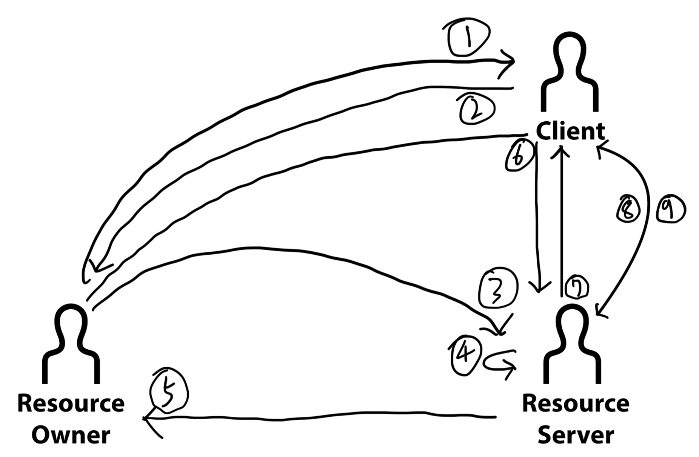

# 1주차 : OAuth 2.0

---

## OAuth를 쓰는 이유

- 회원가입을 해야 이용할 수 있는 서비스가 있다 가정하자.
    1. 사용자는 서비스를 과연 100% 신뢰해도 될까? 서비스에 사용자의 개인 정보를 직접 제공하는 것은 어떻게 보면 부담되는 행위다. (개인정보 유출 가능성, 서비스의 지속 가능성 등등 때문)
    2. 서비스 제공자의 입장에서도 사용자의 개인 정보를 직접 갖고 있는 것은 부담되는 행위다. 개인정보 탈취(해킹 등등)의 위협과 맞서야 하고 보안을 갖추기 위한 여러 프로세스가 필요함.
- 이런 상황 속에서 OAuth는 신뢰할 수 있는 수단을 통해 사용자와 서비스를 쉽게 연동할 수 있도록 돕는다.

## OAuth 프로세스 속 구성 요소

- 사용자 (리소스 오너)
- 나의 서비스 (클라이언트)
- 그들의 서비스 (리소스 서버)
    - 인증 서버도 여기에 포함해서 설명

## 관련 용어

- client_id : 소셜 플랫폼에서의 클라이언트 식별자
- client_secret : 소셜 플랫폼에서의 클라이언트 비밀번호
- scope :  제공 받고자 하는 정보의 범위
- redirect_uri : callback을 응답받기 위한 URI
- AuthorizationCode : 토큰을 발급받기 위한 접근 코드
- AccessToken : 리소스 서버로부터 데이터를 요청하기 위한 토큰
- RefreshToken : AccessToken이 만료됐을 경우 재발급 받기 위해 필요한 토큰

## 동작 프로세스

1. 리소스 오너는 서비스 이용을 위해 클라이언트의 로그인 창에서 `OOO로 로그인` 아이콘을 클릭한다.
2. 클라이언트는 해당 플랫폼의 로그인 페이지를 응답하게 되고, 사용자는 로그인을 수행한다.
3. 로그인 과정에서 client_id, scope, 그리고 redirect_uri가 Query String으로 함께 리소스 서버로 보내진다.
4. 리소스 서버에서는 client_id로 사용자를 판단하고, 해당 사용자가 등록한 redirect_uri와 요청 파라미터로 온 redirect_uri가 일치한지 검증한다. (유효하지 않을 경우 Forbidden)
5. client_id와 redirect_uri가 유효할 경우 리소스 서버는 리소스 오너에게 AuthorizationCode를 포함한 Redirect URI를 응답한다.
6. 리소스 오너는 redirect_uri를 이용해 클라이언트에게 요청을 전송하고, 클라이언트는 AuthorizationCode과 client_id, client_secret, redirect_uri, 그리고 grant_type(AuthorizationCode의 타입)을 Query String으로 포함시켜 리소스 서버에게 토큰을 요청한다.
7. 모든 정보가 유효할 경우 리소스 서버는 AccessToken과 RefreshToken을 클라이언트에게 반환한다.
8. 클라이언트는 AccessToken을 이용해 리소스 서버로부터 사용자의 정보(scope로 정해둔 정보)를 응답받을 수 있다.
9. AccessToken이 만료됐을 경우 RefreshToken을 이용해 리소스 서버에게 AccessToken의 재발급을 요청한다. 그리고 재발급 된 AccessToken으로 다시 요청을 수행한다.

## 개인적인 생각

강의에서 설명한 부분 중 리소스 서버가 리소스 오너에게 AuthorizationCode를 반환하는 과정에서(위의 5, 6번에 해당), 굳이 리소스 오너에게 반환시킬 필요 없이 바로 클라이언트에게 반환하면 되는 것이 아닌가 싶은 생각이 들었다. 클라이언트에서 바로 AuthorizationCode을 응답받아서 토큰을 요청하는 방식이 더 효율적일 것 같다.

## 마무리

OAuth의 가장 큰 장점은 클라이언트의 입장에서 제3자인 플랫폼 서버(리소스 서버)를 통해 사용자의 권한을 인증할 수 있다는 것이다. 위에서 설명했듯이 개인정보를 다루는 부분에 있어 사용자와 서비스 제공자 모두의 부담을 줄일 수 있고, 사용자↔서비스뿐만이 아닌 서비스↔서비스 간의 인증 프로세스도 간편하게 구현할 수 있다는 점이 장점으로 보인다. 
다만 나의 개인정보를 하나의 플랫폼에만 의존시키는 것은 좋지 않을 수 있다. 물론 신뢰할 수 있는 플랫폼이기에 의존할 수 있는 것이지만, 불의의 사고는 언제나 발생할 수 있는 것이니 유의할 필요가 있겠다.

기존에 카카오 로그인 API를 사용해 본 적이 있었지만 다시 한번 OAuth 프로세스에 대해 공부해 볼 수 있어서 좋았다. 소셜 로그인 API를 사용자↔서비스 간의 인증을 위해서만 써왔었는데, 다음에는 서비스↔서비스 간의 연동을 위해서도 사용해 봐야겠다.