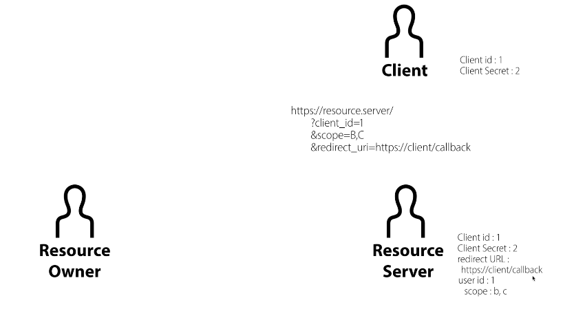
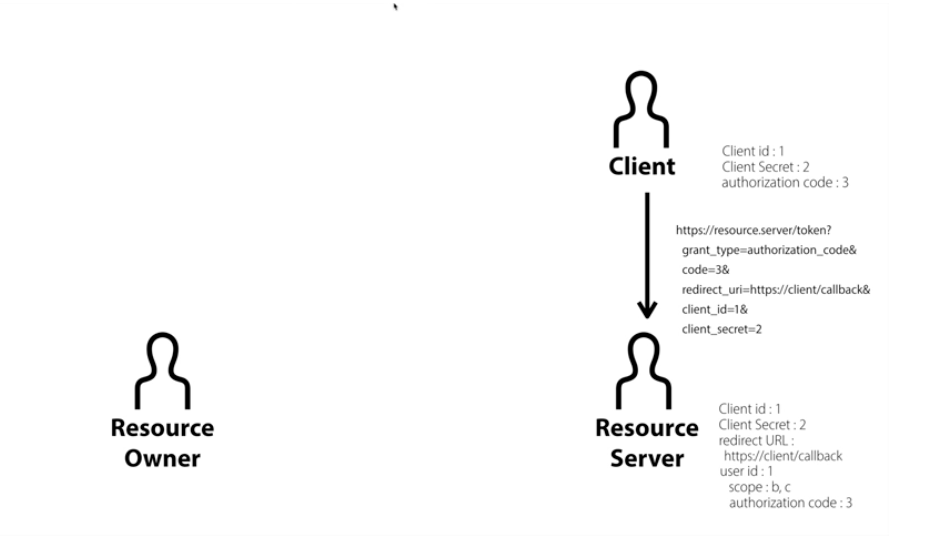
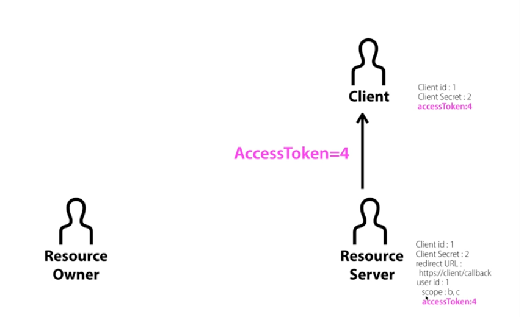
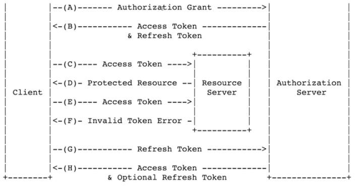

# OAuth 2.0

사용자, 나의 서비스, 나의 서비스를 연동 하려는 자

## 역할
- Resource Owner 
    - 에플리케이션 사용자.
- Client
    - 에플리케이션 서버
- Resource Server
    - 데이터를 가지고 있는 서버
- Authorization Server
    - 인증과 관련된 처리를 전담하는 서버
본 강의에서는 쉬운 설명을 위해 Resource Server와 Authorization Server를 합쳐서 Resource Server로 부르기로 함.

## 등록
    - 클라이언트가 OAuth를 이용하기 위해서는 Resource Server에 승인을 사전에 받아야 함.
    - 서버마다 등록 방법은 다르지만, 공통된 값이 있음.
    - 공통값
        - Client ID : 우리가 만들고 있는 에플리케이션의 색별자. 
        - Client Secret : 식별자의 대한 비밀번호. 
            - 절대로 노출되면 안됨.
        - Authorized redirect URLs : 권한을 부여하는 과정에서 Authorized Code를 전달받기 위한 주소.

## 인증 과정
    # Resource Owner의 승인 과정
    1. Resource Owner가 Client의 서비스에 접속.
    2. 1 과정에서 Client가 Resource Server에 접근이 필요하게 되면(ex. 소셜 간편 로그인) Client는 Resource Owner에게 입력 창을(ex. 구글, 카카오 등) 보내준다.
    3. 2 과정에서 넘어온 입력 창의 주소는 " https://resource.server/?client_id=1&scope=B,C&redirect_url=~~~/callback "
    4. Resource Owner가 입력 값을 채우고 요청을 보내면 Resource Server가 들어온 요청의 client_id와 일치하는 id가 존재하는지 확인 후 존재한다면 scope에 해당하는 권한을 client에게 제공하는 것에 동의하는 창을 Resource Owner에게 보내준다.
    5. Resource Owner가 동의를 하면 Resource Server에는 user_id값과 이 id의 scope가 추가된다.

    

    # Resource Server의 승인 과정
    1. 승인을 위해 바로 Access token을 발급하는 것이 아닌 authorization code(임시 비밀번호)를 Owner에게 제공.
    2. Owner가 Client에게 authorization code를 전달.
    3. Client는 authorization code를 가지고 Resource Server에 요청을 보냄 (ex. https://resource_server/token?grant_type=authorization_code&code=3&redirect_url=https://client/callback&client_id=1&client_scret=2)
    

    # Access Token 발급
    1. 위에 3번과정을 통해 Resource Server가 요청을 받으면, 전달받은 값(client_id, client_secret)이 일치하는지 확인.
    2. 일치하면 Resource Server가 Access Token을 Client에 응답.
    

    # API 호출
    - 발급받은 Access Token을 활용하여 해당 소셜 서비스의 기능을 API호출을 통해 이용 가능.
    - Access Token 전달 방법
        - query parameter방식과 Authorization : bearer방식이 있다. 이 중 후자를 추천한다(보안상의 이유)

    # Refresh Token
    - Access Token은 정해진 수명이 있다. (1시간, 2시간, ..., n일 등)
    - 이 토큰이 만료되면 다시 발급을 해야 하는데, 이 과정마다 사용자에게 로그인을 요청하게 된다면 매우 번거로울 것.
    이를 해결하기 위해 Refresh Token을 사용히여 Access Token을 재발급 받을 수 있다.
    - 이 Refresh Token은 Access Token 발행 시 같이 넘겨준다. (아닌 경우도 있다.)
    

    # 정리
    OAuth는 인증 괴정에 참여하는 3자 Owner, Client, Resource Server가 한자리에 모일 수 없는 상황에서 어떻게 하면 서로를 신뢰할 수 있을지 고민하다 나온 기술이다.
    이 기능은 Client입장에서 Resource Server를 통해 Owner를 검증하고 신뢰할 수 있다는 것이 장점이다.

    OAuth를 사용하여 소셜 로그인을 구현한 경험이 있지만 그때는 개념을 이해하기 보다 구현에 초점을 두어 자세한 동작과정은 이해하지 못한 상황에서 사용했었다.
    본 강의를 학습하면서, OAutn에 개념적인 부분에 대한 이해를 더 높일 수 있었다. 