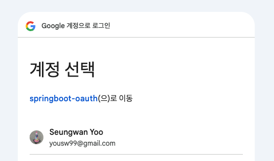

# 2주차 : 스프링 시큐리티 - 2강 5차시까지

2주차에는 스프링 시큐리티와 OAuth 2.0을 이용해 구글 로그인을 구현하는 실습을 진행했다.

## 스프링 시큐리티의 장점

스프링 시큐리티는 보안, 인증 같은 기능을 개발자가 직접 구현할 필요 없이 쉽게 활용할 수 있도록 돕는다. 자체적인 로그인 기능을 제공하고, 사용자 세션 제어, 권한 부여, 그리고 OAuth나 JWT 등 다양한 인증 방식을 쉽게 구현할 수 있다.

## Spring Security - 로그인

스프링 시큐리티는 자체적인 로그인 기능을 제공한다. 로그인에 성공하면 `Authentication` 타입 객체가 생성되어 `SecurityContextHolder(세션)` 에 저장된다. `Authentication` 객체를 생성하기 위해서는 `UserDetails` 타입의 사용자 정보 객체가 있어야 하는데, 개발자는 그 객체를 생성해 스프링 시큐리티에게 제공해줘야 한다.

1. UserDetails 클래스에 사용자 객체를 제공해주는 별도의 클래스(UserDetailsService)를 생성한다.
    
    ```java
    // SecurityConfig에서 로그인 요청이 오면 UserDetailsService 타입으로 IoC되어 있는 loadUserByUsername 메소드 실행
    @Service
    @RequiredArgsConstructor
    public class PrincipalDetailsService implements UserDetailsService {
    
        private final UserRepository userRepository;
    
        @Override
        public UserDetails loadUserByUsername(String username) throws UsernameNotFoundException {
            User userEntity = userRepository.findByUsername(username);
            if (userEntity != null)
                return new PrincipalDetails(userEntity);
            return null;
        }
    }
    ```
    
    `PrincipalDetailsService` 클래스는 로그인 요청 발생 시 가장 먼저 호출되어, 로그인 요청 시 전달 된 `username` 파라미터를 이용해 DB에서 사용자를 검색하고 사용자 객체를 반환한다.
    

1. 사용자 정보 객체(UserDetails) 제공 클래스 생성
    
    `isAccountNonExpired`, `isAccountNonLocked`, `isCredentialsNonExpired`, `isEnabled` 메소드는 현재 사용자 계정 상태에 대한 조건을 검증하는 메소드이다. 계정 휴면 상태, 탈퇴 상태 등의 조건을 걸어 상세하게 구현할 수 있으나 현재는 생략한다.
    
    ```java
    @AllArgsConstructor
    public class PrincipalDetails implements UserDetails {
    
        private User user;
    
        @Override
        public boolean isAccountNonExpired() {
            return true;
        }
    
        @Override
        public boolean isAccountNonLocked() {
            return true;
        }
    
        @Override
        public boolean isCredentialsNonExpired() {
            return true;
        }
    
        @Override
        public boolean isEnabled() {
            return true;
        }
    
        // User가 가지고 있는 권한 목록을 리턴한다.
        @Override
        public Collection<? extends GrantedAuthority> getAuthorities() {
            Collection<GrantedAuthority> collect = new ArrayList<>();
            collect.add((GrantedAuthority) () -> user.getRole());
            return collect;
        }
    		
    		// User의 비밀번호 리턴
        @Override
        public String getPassword() {
            return user.getPassword();
        }
    
    		// User의 사용자이름(id) 리턴
        @Override
        public String getUsername() {
            return user.getUsername();
        }
    }
    ```
    
    `PrincipalDetailsService` 로부터 전달된 사용자(User)객체를 이용해 `UserDetails` 객체를 생성한다. `UserDetails` 속에는 사용자 권한, 사용자 이름, 비밀번호 등의 주요 인증 정보들이 담겨있다. 
    
    스프링 시큐리티 내부에서 `UserDetails` 객체를 통해 사용자의 비밀번호를 검증하고, 권한을 확인하는 등의 인증 과정을 거친다.
    

## Spring Security - 권한 처리

Spring Security를 이용하면 엔드포인트(URL)별 접근 권한을 설정할 수 있다. 예를 들어 관리자 기능과 연관된 엔드포인트일 경우 ADMIN 권한을 가진 사용자만 접근하도록 제한할 수 있다.

설정의 일관성을 갖추기 위해서 특수한 경우에만 `@Secured()` 메소드를 이용하고, 일반적인 상황에서는 `SecurityConfig`을 통해 접근 권한을 설정하는 것이 좋아보인다.

### 권한 설정 방법

1. SecurityConfig에서 설정
    
    스프링 부트로 들어오는 요청들은 여러 개의 보안 필터를 거치게 되는데, 이를 `SecurityFilterChain`이라고 부른다. 여러 개의 보안 필터(조건)을 적용하여 요청에 대한 권한 인증을 처리한다. 아래는 `SecurityConfig`에서 `FilterChain`에 접근 권한 제어를 추가하는 방식이다.
    
    ```java
    // SecurityConfig.java
    ....
    // 엔드포인트 별 권한 제어
    .authorizeHttpRequests(auth -> auth
            .requestMatchers("/user/**").authenticated() // 로그인만 되어있으면 접근 가능
            .requestMatchers("/manager/**").hasAnyRole("ADMIN", "MANAGER") // ADMIN, MANAGER 권한 사용자만 접근 가능
            .requestMatchers("/admin/**").hasRole("ADMIN") // ADMIN 권한 사용자만 접근 가능
            .requestMatchers("/**").permitAll() // 그 이외는 모두 접근 가능
    )
    ....
    ```
    
2. Controller 메소드 단위에서 설정
    - SecurityConfig 클래스 상단에 아래의 어노테이션을 추가한다.
    
    ```java
    // SecurityConfig.java
    @EnableMethodSecurity(securedEnabled = true, prePostEnabled = true) // 컨트롤러 메소드 단위의 권한 설정을 활성화
    ....
    ```
    
    - Controller 메소드 상단에 어노테이션을 추가한다.
    
    ```java
    // @PreAuthorize("hasRole('ROLE_ADMIN') or hasRole('ROLE_MANAGER')")
    // @PostAuthorize()도 있음
    @Secured("hasRole('ROLE_ADMIN') or hasRole('ROLE_MANAGER')") // 최신 방식
    @GetMapping("/info")
    @ResponseBody
    public String info() {
        return "정보임";
    }
    ```
    

## Spring Security - OAuth 2.0을 이용한 구글 로그인

1. Google API 콘솔에 접속해 아래 과정을 수행한다
    1. OAuth 클라이언트 ID, Secret 키를 발급받는다
    2. Redirect URI를 설정한다 (아래 URI는 `Spring Security OAuth2 Client` 라이브러리 내부적으로 지원하는 URI로, 변경이 불가능하다.)
        
        ```
        /login/oauth2/code/google
        ```
        
2. build.gradle에 `Spring Security OAuth2 Client` 라이브러리 의존성을 추가한다.
    
    이 라이브러리를 통해 손쉽게 소셜 플랫폼으로 부터 사용자 정보를 불러올 수 있다.
    
    ```yaml
    implementation 'org.springframework.security:spring-security-oauth2-client:6.3.3'
    ```
    
3. application.yml에 OAuth API 관련 설정을 추가한다
    
    ```yaml
    security:
      oauth2:
        client:
          registration:
            google:
              client-id: {client-id}
              client-secret: {client-secret}
              scope: # 가져올 정보 범위
                - email
                - profile
    ```
    
4. OAuth 로그인 후처리를 위한 서비스 클래스를 생성한다.
    
    Google API 콘솔에 등록한 Redirect URI로 사용자 정보가 응답되게 되는데, 그 정보를 처리하기 위한 클래스이다.
    
    ```java
    @Service
    public class PrincipalOauth2UserService extends DefaultOAuth2UserService { // OAuth 로그인 후처리를 위한 서비스
        // 구글로 부터 받은 userRequest 데이터에 대한 후처리되는 함수
        @Override
        public OAuth2User loadUser(OAuth2UserRequest userRequest) throws OAuth2AuthenticationException { 
    		    // 액세스 토큰을 출력한다
            System.out.println("getAccessToken() = " + userRequest.getAccessToken().getTokenValue());
            // 사용자 정보를 출력한다 (이메일, 이름, 등등...)
            System.out.println("getAttributes = " + super.loadUser(userRequest).getAttributes());
            
            return super.loadUser(userRequest);
        }
    }
    ```
    
5. `SecurityFilterChain` 에 OAuth 로그인 필터를 추가한다.
    
    ```java
    ....
    .oauth2Login(oauth2Login -> oauth2Login
            .loginPage("/loginForm")
            .userInfoEndpoint(userInfo -> userInfo.userService(principalOauth2UserService))
    );
    ....
    ```
    
6. HTML 페이지에 구글 로그인 접근 링크를 추가한다. 아래 링크 또한 `Spring Security OAuth2 Client` 라이브러리 내부적으로 지원하는 URI로, 변경이 불가능하다.
    
    ```yaml
    /oauth2/authorization/google
    ```
    
7. 로그인 링크로 접속하면 아래 사진과 같이 로그인 화면이 등장하며, 로그인이 완료되면 서버에 사용자 정보가 불러와지고 사용자 인증, 세션 생성이 이루어진다.
    
    
    

## 마무리

인증, 권한 관련 로직을 개발자가 직접 구현할 필요가 없다는 것이 Spring Security의 장점으로 느껴졌다. 또한 OAuth와의 연동도 단순해서 소셜 로그인 기능을 프로젝트에 도입하기 매우 단순해 보인다. 다만 이미 있는 라이브러리를 활용하는 것 이기에 쓰는 방법만 알면 간단해보이지만, 실제 동작 프로세스를 이해하는 것은 어렵게 느껴진다. 기회가 된다면 더 깊게 파보고 싶다.