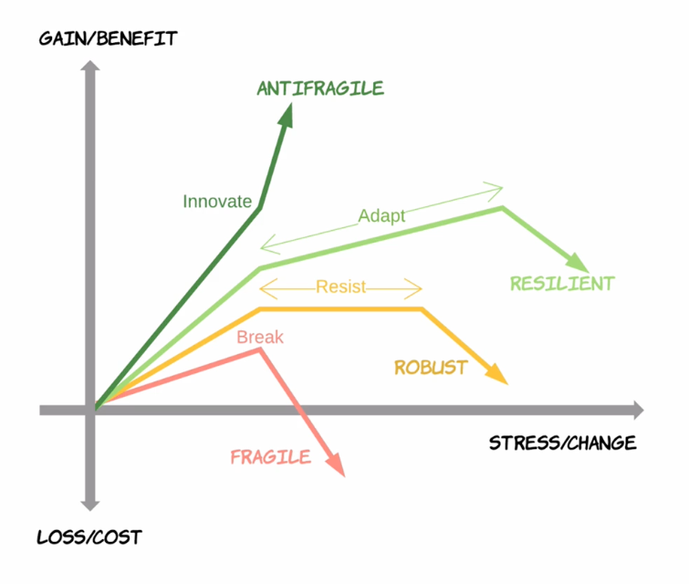
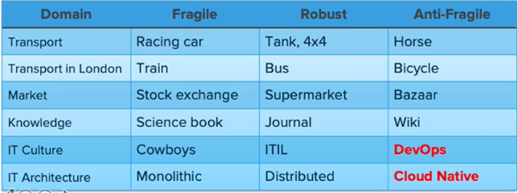

# Part 2 Spring Cloud로 개발하는 마이크로서비스 애플리케이션(MSA)

## 3주차

---

## 소프트웨어 아키텍쳐

1960~80년대는 하드웨어가 우선인 시기 → 깨지기 쉬운 시스템

1990~2000년대 안정성이 우선

2010년대~ 확정성과 안정성을 더욱 강화

# ANTIFRAGILE의 특징

1. 오토 스케일링 : 사이즈를 수작업으로 늘였다 줄였다가 하는게 아니라 자동으로 처리함
2. 마이크로 서비스 : 넷플릭스와 아마존은 클라우드를 가장 잘 활용하는 기업중 하나,기존 시스템들과 다르게 전체 서비스를 구축하고 있는 모듈이나 기능을 독립적으로 개발함
3. 카오스 엔지니어링 : 예측하지 못하는 상황이라도 견딜수 있게 구축되어야함
4. 배포 파이프라인 : 수십수백개의 마이크로서비스를 배포할때 자동으로 연결시키면 빠르게 적용시킬수 있음

---

## Cloud Native Architecture

- 확장가능한 아키텍쳐
    - 시스템의 수평적 확정에 유연
    - 확장된 서버로 시스템의 부하 분산, 가용성 보장
    - 시스템 또는 서비스 어플리케이션 단위의 패키지
    - 모니터링
- 탄력적 아키텍쳐
    - 서비스 환경변화에 대응시간 단축
    - 분할된 서비스 구조
    - 무상태 통신 프로토콜
    - 서비스 추가와 삭제 자동으로 감지
    - 변경된 서비스 요청에 따라 사용자 요청 처리
- 장애 격리
    - 특정 서비스에 오류가 발생해도 다른 서비스에 영향 주지 않음

---

## Cloud Native Application

1. 마이크로 서비스로 개발된다
2. CI/CD를 통하여 자동으로 배포됨→ 지속적인 통합과 지속적인 배포
    
    카나리 배포와 블루그린 배포와 같은 방법을 선택할수 있음
    
3. 데브옵스 → 개발과 운영을 통합 의미
4. 컨테이너 가상화 기술을 사용함 → 로컬에서 하던걸 클라우드 환경으로 옮김, 적은리소스를 사용함.운영체제 위에 컨테이너를 올리고 그 위에다 실행함. 

---

## 12 Factors

클라우드 네이티브 개발을 할때 고려해야할 12가지이다.

1. 코드 베이스 : 형상관리를 위해 코드를 한곳에서 배포하고 코드의 통일적인 관리가 필요하기 때문에 중요함
2. 종속성 : 각 시스템은 각자에 종속되어있어야함
3. 컨피규레이션 : 시스템 외부에서 구성관리 도구를 통해 제어함
4. 서비스 지원 : 보조서비스 DB,캐시,메시지 브로커등을 통해 추가로 지원함
5. 빌드와 릴리즈와 실행환경을 각각 분리 : 각각은 고유한 아이디가 있어야하고 롤백이 되야하며 CICD를 이용해야함
6. 프로세스 : 각각의 서비스는 실행중에 다른서비스와 분리되고 독립적이어야함
7. 포토 바인딩 : 각각의 서비스는 자체 포트에서 자체에 포함된 기능이 있어야함
8. 동시성 : 사용가능한 가장 강력한 인스턴스로 확장하는것과는 반대로 많은수의 동일한 프로세스를 복사해서 확장하게 됨.
9. 서비스 인스턴스 자체가 삭제해야하고 정상적으로 종료 가능하여야 함
10. 개발단계와 프로덕션 단계를 분리해야함.
11. 로깅 시스템: 마이크로 서비스가 실행 되지 않더라도 로그는 작동해야하고 모니터링 해야함
12. 프로세스 : 모든 마이크로서비스들을 어떤 상태로 사용되고 있으며 리포팅할수 있는 도구가 있어야함

+3

1. API First : 사용자가 우선이 되어야 함
2. 모든 지표는 수치화되어야함
3.  API를 사용함에 있어서 인증은 필수이다.

---

느낀점 : 대기업들이 사용하는 기술답게 좀 어려운것 같지만 새로운 기술을 배울 생각에 기대가 된다.

아직 개인적이거나 작은 프로젝트 단위에선 자원 소모가 많아서 적용할 일이 없을것 같은 기술이기도 하다.