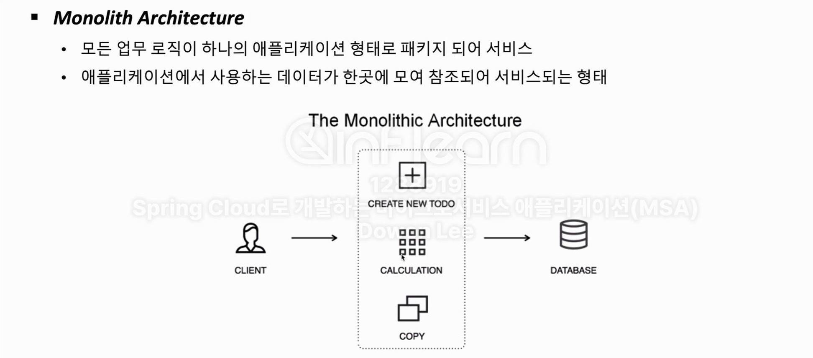
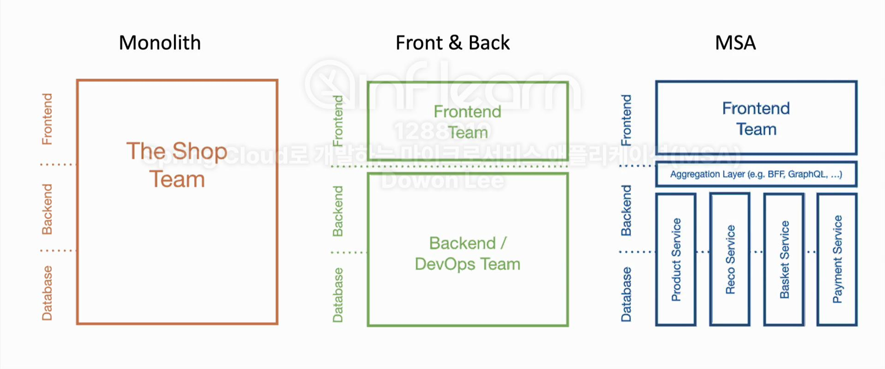
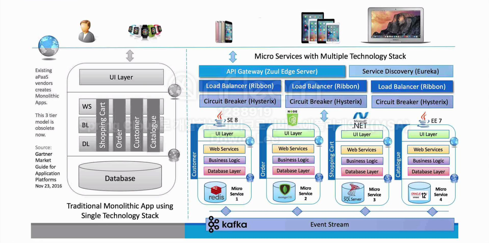
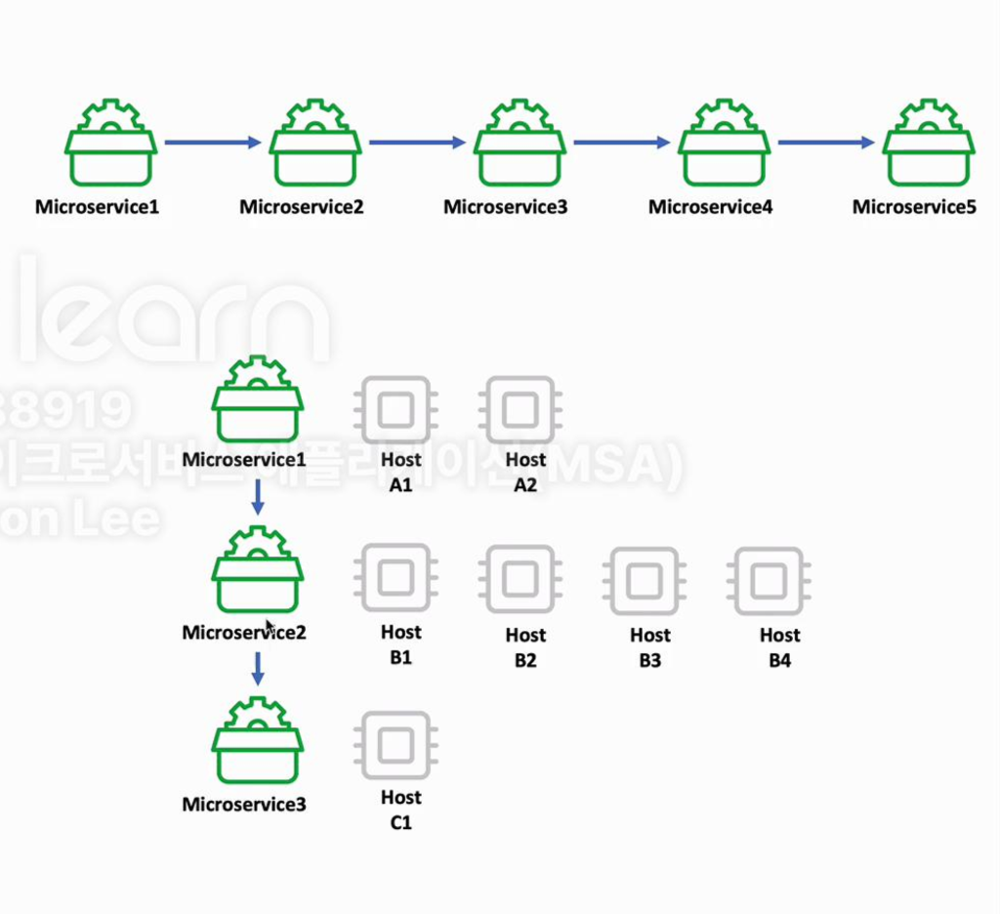
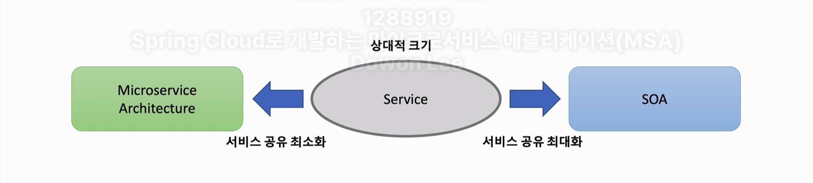
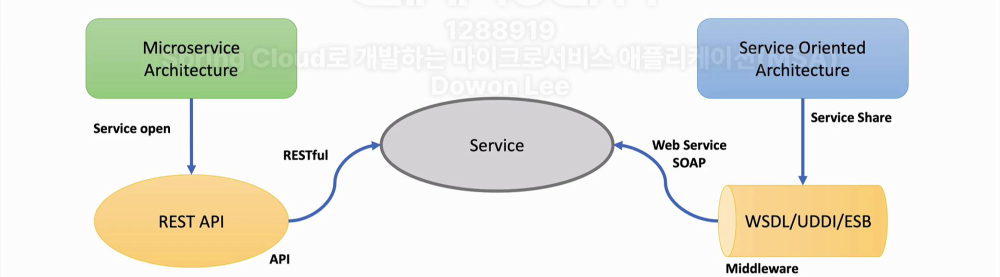
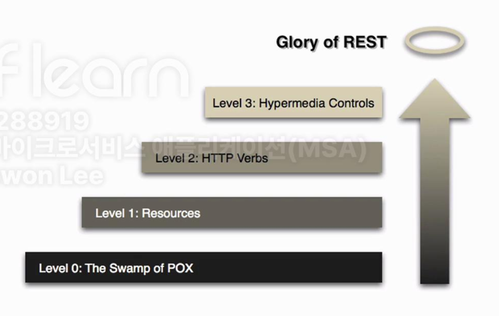
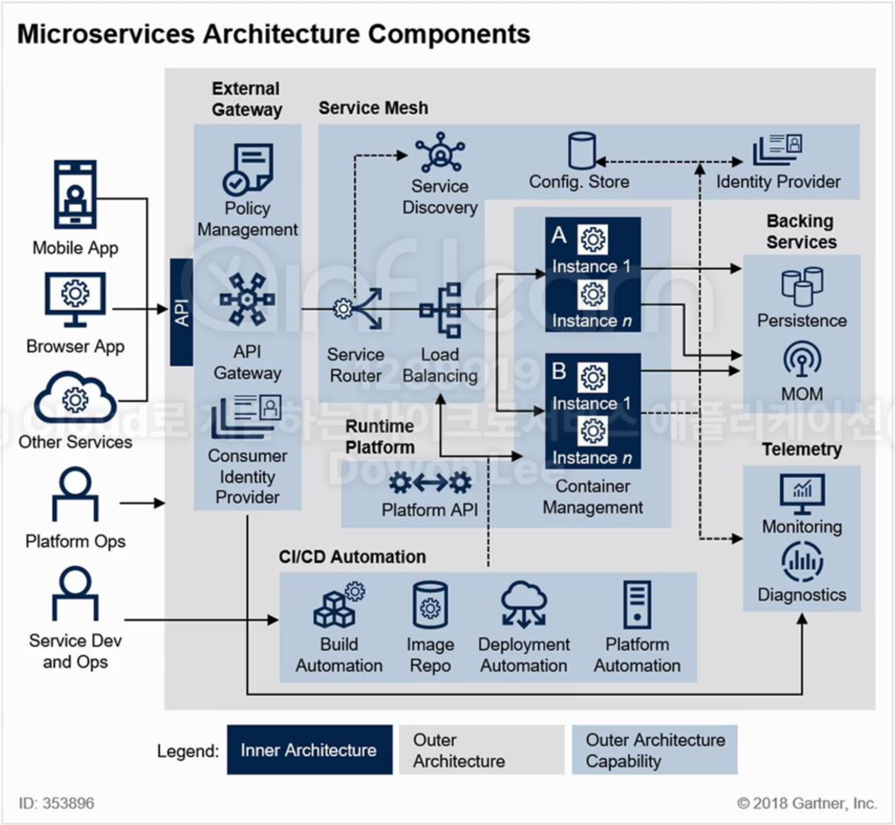
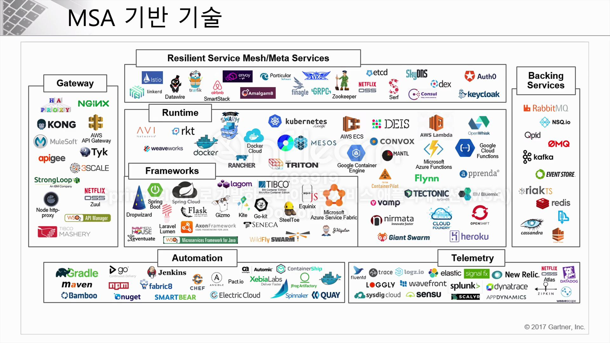

# Part 2 Spring Cloud로 개발하는 마이크로서비스 애플리케이션(MSA)

---

## Monolihic VS. MSA

모놀리스 방식은 모두 소프트웨어 하나에 포함시키는 방식

프론트엔드 백엔드 디비 이게 다 하나에 있음. 하나의 건축물과 같다.

이와 상반되는게 모두 분리해서 개발하는 msa 방식.

- 하나의 시스템이 모두 패키징 되어있기때문에 일부를 수정해도 다시 빌드하고 테스트해야함.

### MSA

언어와 db는 각각 자기가 잘하는 분야가 있을것이다. 이런 장점만 살려서 각각 기능에 맞춰서 어플리케이션 개발에 사용하면 좋지 않을까?

이를 api를 사용해서 제어한다면??

**모놀리스와 msa 중간의 방식도 있다**

우리가 흔히 사용하는  프론트엔드와 백엔드를 분리하는 방식!

또한 msa를 사용하면 다양한 디바이스를 고려하는것도 가능하다.

---

## Microservice Architecture란?

1. 기존의 개발방식을 바꿔야함
2. 독립적인 작은서비스로 이루어짐
3. 하나가 여러개가 되기도 하고 여러개가 하나가 되기도 함
4. 상태에 통신하는것을 권장
5. 외부 시스템으로 관리
6. 클라우드 네이티브 기술을 최대한 활용함
7. 스케일업다운을 동적으로 처리함
8. 시각화 할수있는 관리도구를 같이 가지고 있어야함
9. CI/CD

# “모든것은 마이크로 서비스가 되어야한다?”

그것은 절대 아니다.

비용이나 시간을 얼마나 고려하는가?

독립적으로 개발되고 운영될수 있도록 서비스 경계가 잘 만들어져 있는가?

유지보수 및 확장성이 잘되어있는가?

오류가 격리되어 잇는가?

외부 종속성과 상화작용을 단순화 시켰는가

여러가지 프로그래밍 언어,기술을 지원하는가?

**이런것들을 고려를 잘 해야한다.**

---

## SOA VS. MSA

SOA - 재사용을 통한 비용절감

MSA - 서비스간의 결합도를 낮추어 변화에 능동적으로 대응

SOA - 공통서비스를 서비스 버스에 모아 사업 측면에서 공통 서비스형식으로 서비스 제공

MSA - 각 독립된 서비스가 노출된 REST API를 사용

### RESTful Web Service

level 0 

기존의 리소스를 단순하게 웹서비스 상태로서 제공하기 위해 url만 매핑함

level 1

리소스에 대해 의미있게 url로 제공하지만 http 메소드를 사용하진 않음

level 2

level1+HTTP Methods

level 3

level2+HATOAS / 데이터를 받고 그다음 단계에서 무엇을 할수 있는지 넘겨주는것

SOA MSA둘의 차이는 서비스를 어디까지 공유하느냐가 있다.

---

## **Microservice Architecture Structures**

## **외부 인터페이스**

- Mobile App, Browser App, Other Services: 사용자나 외부 서비스가 시스템에 접근하는 진입점이다.
- Platform Ops, Service Dev and Ops: 플랫폼 운영 및 서비스 개발/운영 담당자들의 접근점이다.

## **외부 게이트웨이**

- API Gateway: 모든 클라이언트 요청의 진입점 역할을 한다.
- Policy Management: 접근 정책을 관리한다.
- Consumer Identity Provider: 사용자 인증을 담당한다.

## **서비스 메시**

- Service Discovery: 서비스 위치를 찾는 기능을 제공한다.
- Service Router: 요청을 적절한 서비스로 라우팅한다.
- Load Balancing: 부하를 분산시킨다.

## **런타임 플랫폼**

- Container Management: 컨테이너를 관리한다.
- Instance 관리: 서비스 A와 B의 여러 인스턴스를 관리한다.

## **백엔드 서비스**

- Config. Store: 구성 정보를 저장.
- Identity Provider: 내부 서비스 간 인증을 담당.
- Persistence: 데이터 저장소.
- MOM (Message-Oriented Middleware): 메시지 기반 미들웨어.

## **텔레메트리**

- Monitoring과 Diagnostics: 시스템 모니터링 및 진단 기능을 제공.

## **CI/CD 자동화**

- Build Automation, Image Repo, Deployment Automation, Platform Automation: 지속적 통합 및 배포를 자동화.

이렇게 많은 기술들이 msa의 기반 기술이 될수 있다!

---

## Spring cloud란?

스프링 클라우드를 이용하게 되면 환경설정 관리라든가 아니면 서비스 검색이라던가,회복성 처리,라우팅 플러시 기타등등의 서비스를 사용함에 있어서 필요한 분산시스템에 빠르게 어플리케이션을 개발하는데 목적을 두고 스프링 클라우드가 만들어졌다.

스프링 부트랑 스프링 클라우드가 연동되어 같이 프로젝트를 한다.

환경설정은 클라우드 컨피그 서버

서비스 등록과 위치정보 확인, 검색등을 위해선 넷플릭스의 유레카 서버

로드밸런싱을 위해선 스프링 클라우드게이트웨이

마이크로 서비스간 통신을 위해서는 레스트 템플릿이나 pain

집킨이나 elk 스택같은 서비스를 위해 외부 모니터링

장애 복구를 위해 회복성 패턴을 위해서는 hystirx 제품을 사용
