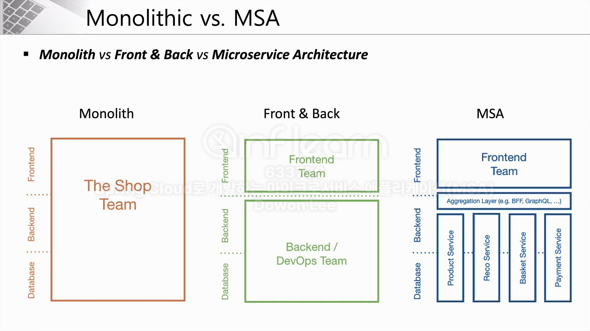
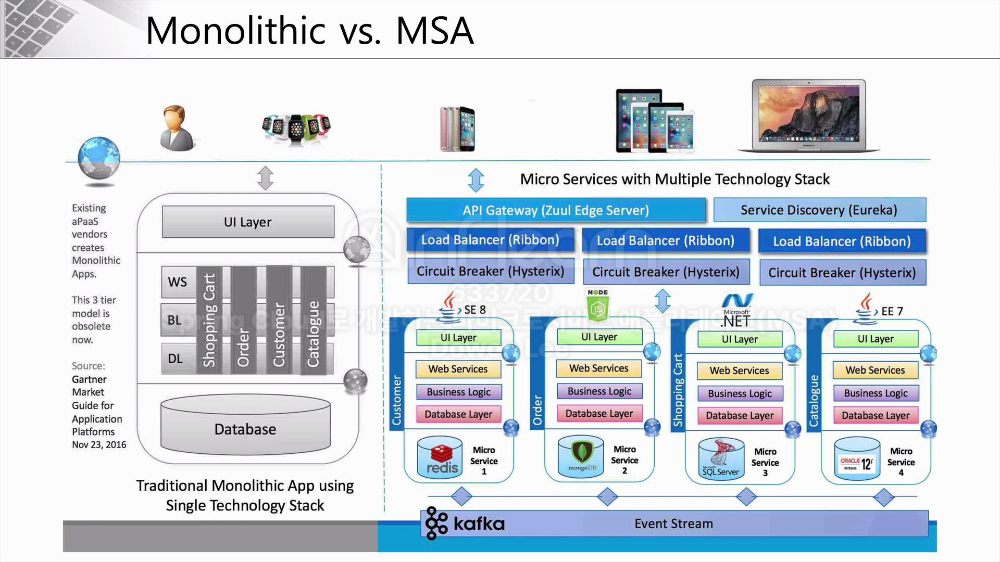
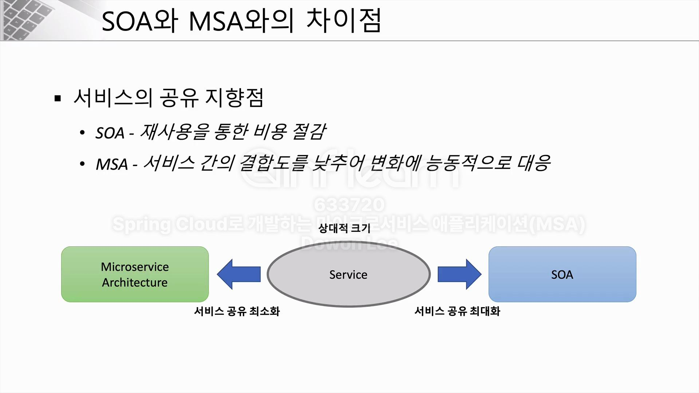
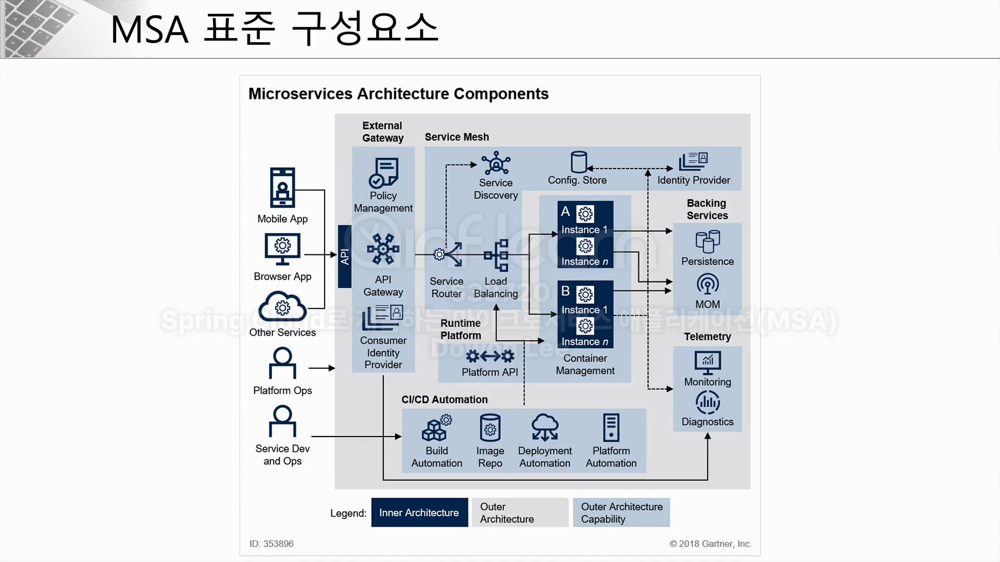
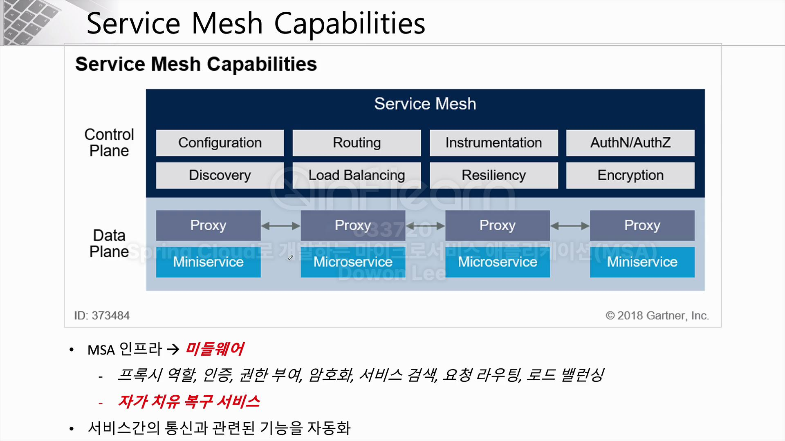
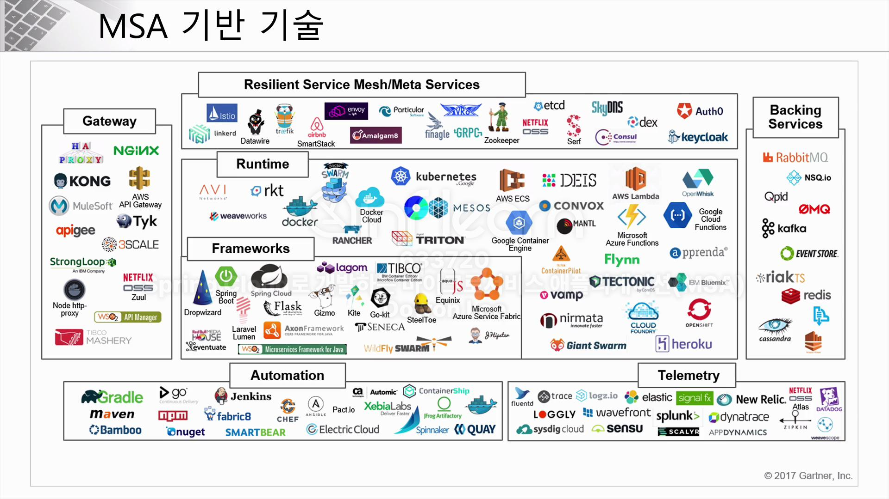
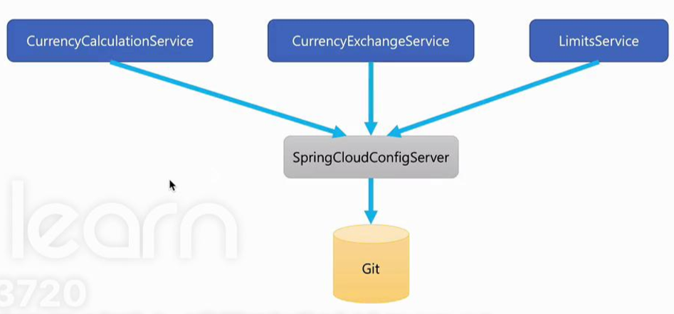
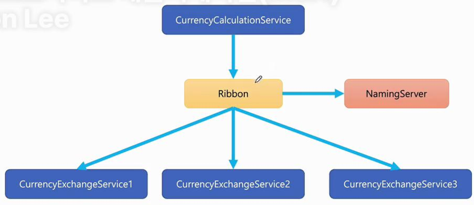

# 4주차 : Spring Cloud MSA #1

## 섹션1 : Microservice와 Spring Cloud (11번째 강의까지)

## Monolithic vs Microservice

- Monolithic 방식
    
    애플리케이션을 개발함에 있어서 필요한 모든 요소를 하나의 커다란 소프트웨어에 포함시켜 개발하는 것.
    
    - 데이터베이스 로직
    - 비즈니스 로직
    - 그 외 프론트엔드 기술까지 포함
- Microservice 방식
    - 애플리케이션을 구성하는 각각의 구성 요소 및 서비스의 내용을 분리해 개발하고 사용하는 방식.
    - 서비스의 유지 보수, 변경 사항 적용에 더 유리함.
    - 다른 서비스에 영향을 주지 않고 독립적인 배포가 가능함. 애플리케이션 전체가 다운 타임이 생기는 일이 없다.
    
    Monolithic 방식으로 설계 된 서비스 안에 User Service, Auth Service, Order Service 같은 비즈니스 로직들이 하나로 모여있다고 가정하자. 마이크로 서비스는 이 비즈니스 로직(Service)을 하나씩 쪼개서 각각의 비즈니스 로직마다 개발/유지보수 하는 방식이다.
    
    이렇게 되면 `각각의 마이크로 서비스들은 서로 다른 기술 스택을 가질 수 있다`. 사용자에게 제공되는 데이터만 정형화(JSON) 되어 있으면 되기 때문에 기술 스택을 하나로 통일할 필요가 없는 것이다. 이렇게 나눠져 있는 마이크로 서비스들을 하나로 연결하기 위해 통일된 별도의 API 게이트웨이가 필요하고, 서비스 부하 분산을 위한 로드 밸런싱, 데이터 동기화 기술, 그리고 서비스 상태 모니터링 기술이 필요하다.
    

## Microservice Architecture

- 마이크로 서비스의 특징
    1. Challenges
    2. Small Well Chosen Deployable Units
    3. Bounded Context
    4. RESTful
    5. Configuration Management
    6. Cloud Enabled
    7. Dynamic Scale Up And Scale Down
    8. CI/CD
    9. Visibility
- 모든 서비스가 마이크로 서비스 아키텍처 구조를 갖출 필요는 없다.
- 마이크로 서비스 아키텍처를 도입하기 전 고려해야 할 사항
    1. 로직 변동의 빈도
    2. 독립적인 생명주기를 갖고 있는가
    3. 독립적인 확장성을 갖고 있는가
    4. 격리된 오류 (오류가 발생한다면 다른 서비스에 영향을 주는가)
    5. 외부 종속성과의 상호작용 단순화
    6. Polyglot(여러 가지 프로그래밍 언어, 스토리지 기술) 기술을 지원하는가?
- 마이크로 서비스는 작게 쪼개진 서비스들이므로, 작은 서비스를 여러 개 조합해 또 다른 서비스를 만들 수도 있다. 마치 레고 블록처럼.

## SOA 와 MSA의 차이점

- SOA(Service Oriented Architecture) : 서비스 재사용을 통한 비용 절감. 공통의 서비스를 ESB(엔터프라이즈 서비스 버스)에 모아 사업 측면에서 공통 서비스 형식으로 서비스 제공
- MSA : 서비스 간의 결합도를 낮추어 변화에 능동적으로 대응. 마이크로 서비스 간 API를 통해 통신해야 한다. 하나의 서비스에 장애가 발생해도 다른 서비스에는 영향이 없어야 함. 각 독립된 서비스가 RestAPI를 사용.

## RESTful API

- RestfulAPI의 특징
    - URI는 명사 형태로 표현해야 하고, 단수가 아닌 복수 형태로 표현해야 함.
- RESTful API의 Level
    - LEVEL 0 : URI에 필요한 액션을 나타냄
    - LEVEL 1 : 필요한 리소스를 URI로 나타냄
    - LEVEL 2 : LEVEL 1 단계 + 다양한 HTTP 메소드로 액션을 나타냄
    - LEVEL 3 : LEVEL 2 단계 + HATEOAS 기능을 추가하여 연계함. 다음 단계에 어떤 작업을 수행할 것인가에 대한 데이터도 포함됨.

## MSA의 구성 요소

1. 모바일 앱, 웹, 혹은 다른 서비스(모두 클라이언트라고 부른다)에서 API 게이트웨이를 통해 필요한 서비스를 요청한다.
2. 클라이언트로부터 온 요청을 `Service Router`에게 넘겨서 어느 서비스로 전달 시킬지 판단한다.
3. 필요한 서비스가 어디에 저장되어있는지 `Service Discovery`를 통해 파악한다.
4. `Load Balancer`를 거친 후, 필요한 서비스(마이크로 서비스)로 이동해 작업을 수행한다.
5. `Micro Service` 를 동작시키기 위한 환경 설정(Config)은 외부에서 관리되어야 한다.
6. 개발 된 서비스는 CI/CD 파이프라인을 통해 자동으로 빌드 되고 서버 인스턴스에 배포된다.
7. `Backing Service`를 이용해 마이크로 서비스에 연결되어 있는 다양한 스토리지를 모아서 관리할 수 있도록 하고, 하나의 서비스와 다른 서비스를 연결해 메시지를 주고받도록 할 수 있다.
8. `Telementry` 기능은 마이크로 서비스의 모니터링, 진단 기능을 갖고 있다.

### Service Mesh란?

마이크로 서비스 아키텍처를 적용한 시스템의 내부 통신을 담당하는 `Infrastructure Layer`이다.

복잡한 내부 네트워크를 추적/관리하고, 내부 네트워크의 안정성, 신뢰성, 탄력성, 가시성, 보안성 등을 확보할 수 있게 된다.

### MSA 기반 기술들

- Gateway : API 접근을 위한 게이트웨이
- Service Mesh : MSA 운영을 위한 기술
- Runtime : 운영 환경을 의미함. Cloud Native Architecture의 특징 중 하나인 컨테이너 가상화 기술도 여기에 포함됨.
- Frameworks : 애플리케이션을 개발하기 위한 프레임워크
- Backing Service : DB 관리, 이벤트 스트림, 메시징 등의 기술
- Automation : CI/CD를 위한 기술
- Telemetry : 여러 마이크로 서비스를 모니터링 하기 위한 기술

## Spring Cloud

`Monolithic` 방식이 아닌, 독립적으로 개발되고 유지되는 `마이크로 서비스 아키텍처`를 지원하기 위한 프레임워크이다.

### 구성 요소

- Centralized configuration management
    
    
    
    - 환경 설정 관리를 위해 `Spring Cloud Config Server` 이용
    - 서비스 유지 보수에 도움 됨
- Location transparency
    - Naming Server(Eureka) - 서비스의 등록, 위치 확인 등의 기능
- Load Distribution (Load Balancing)
    
    
    
    - Ribbon (Client Side)
    - Spring Cloud Gateway
- Easier REST Clients
    - FeignClient - 마이크로 서비스 간 RESTful API 통신
- Visiblity and monitoring (시각화와 모니터링)
    - Zipkin Distributed Tracing
    - Netflix API gateway
- Fault Tolerance
    - Hystrix - 장애 발생 시 빠르게 회복하기 위한 회복성 패턴 기술

## 마무리
섹션 1을 공부하면서 MSA를 구성하기 위해 다양한 기술과 툴이 필요함을 알게 되었고, 이런 기술 간의 통신을 구성하고 규칙을 갖추는 것도 상당한 작업이 될 것 같다는 생각이 들었다. 
MSA 같은 큰 규모의 복잡한 아키텍처 구성은 해 본 적이 없기에 앞으로 진행될 실습이 더 기대된다.
