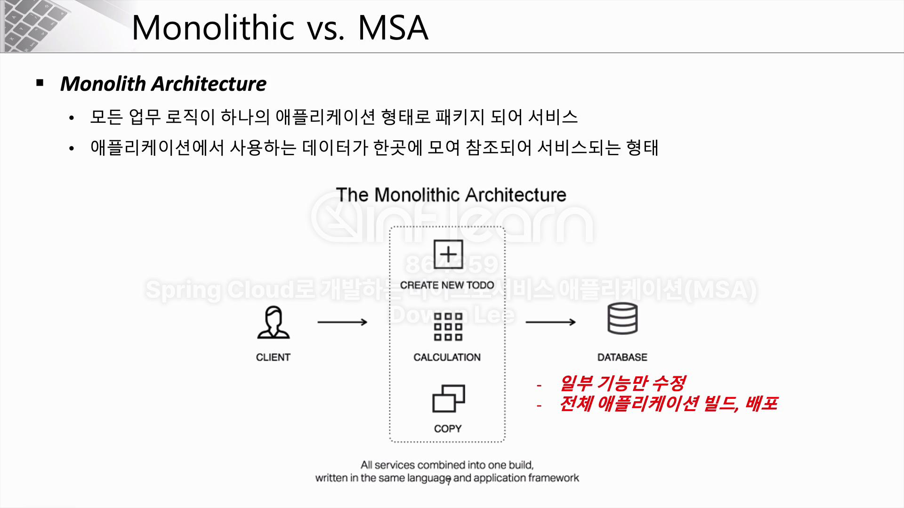
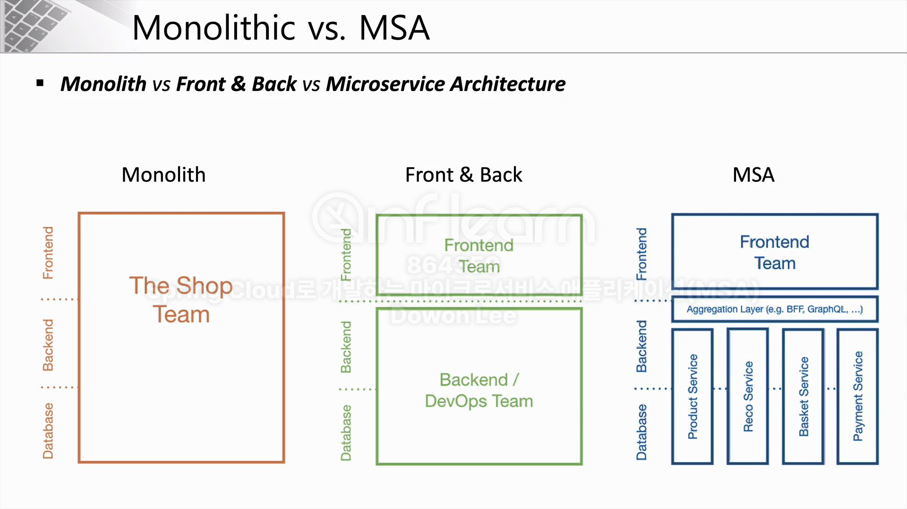
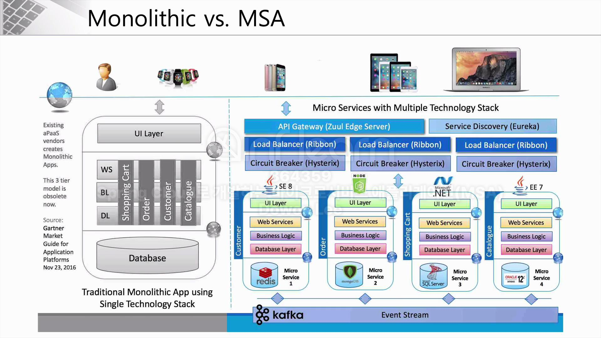
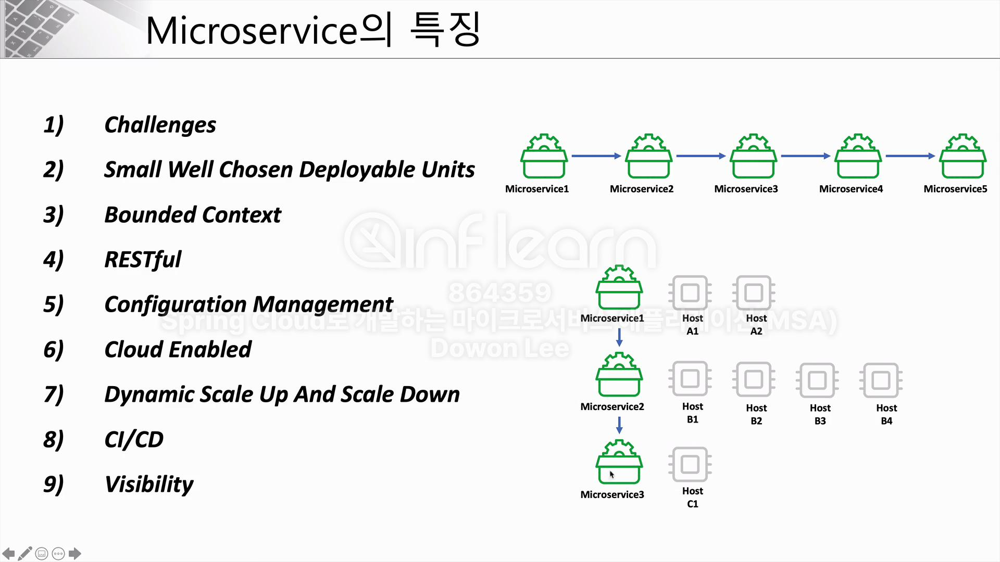
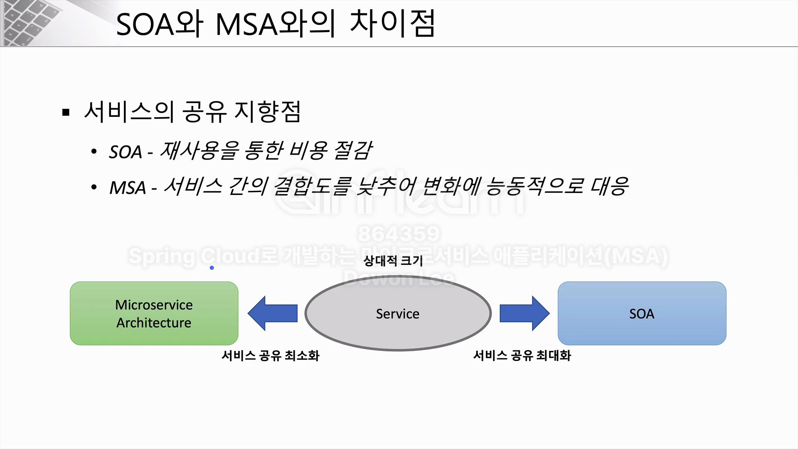
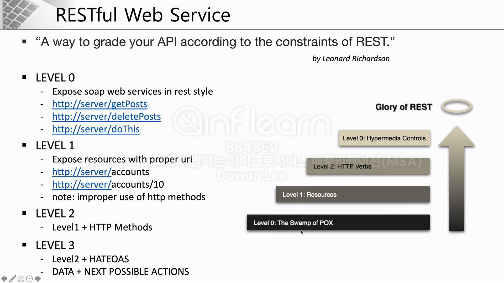
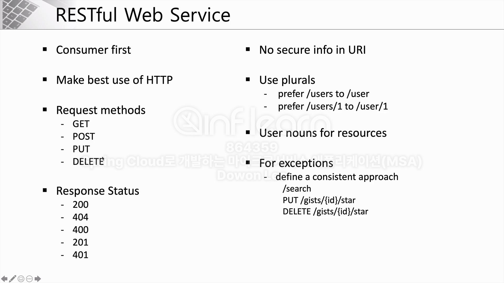
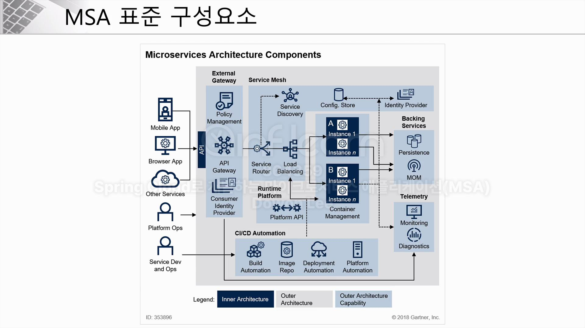
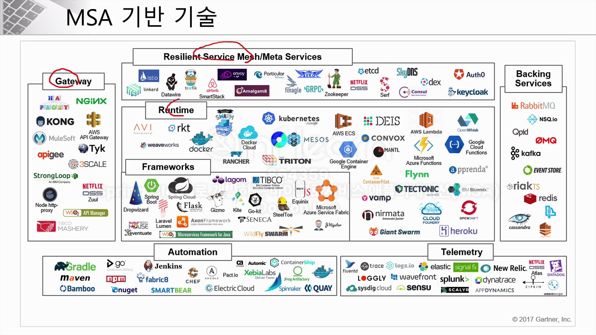

# 4주차

## Monolithic vs. Microservice
### Monolith방식
- 애플리케이션 개발 시 필요한 모든 요소를 하나의 커다란 소프트웨어 안에 포함시키는 것
- DB괸련 로직, 비즈니스 로직, FE기술 등 모든 서비스 내용이 하나의 애플리케이션 안에 유기적으로 연결되어 작동
- 서로 의존성을 가지고 패키징 및 배포가 됨.

### Microservice방식
- 어플리케이션을의 각각의 구성요소 및 서비스의 내용을 분리해서 개발 및 운영.
- 유지보수나 변경사항 적용에 더 유리함.
- 다른 서비스의 영향이 최소화 됨.

### Monolith Architecture
- 모든 업무 로직이 하나의 애플리케이션 형태로 패키지 되어 서비스.
- 애플리케이션에서 사용하는 데이터가 한곳에 모여 참조되어 서비스되는 형태.
- 문제점
    - 시스템 일부만 수정해도 전체를 빌드 및 배포해야 함.

### Microservice
- 함께 작동하는 작은 규모의 서비스들.
- 작은 규모의 여러 서비스의 묶음.
- 비즈니스 기능을 중심으로 구축 및 완전환 자동화 시스템을(CI/CD) 사용.
- 최소한의 중앙 집중식 관리, 서로 다른 프로그래밍 언어, 서로 다른 데이터 저장기술을 사용할 수 있음.

### Monolith VS Front & Back VS MSA의 차이
- Monolith
    - FE, BE, DB의 기술이 하나로 통합
- Front & BacK
    - FE와 BE, DB의 영역이 분리되어 있음.
- MAS
    - FE와 BE, DB의 영영이 각각의 서비스에 맞게 분리되어 있음.

# MicroService의 특징
1. Challenges
2. Small Well Chosen Deployable Units
3. Bounded Context
4. RESTful
5. Configuration Management
6. Cloud Enabled
7. Dynamic Scale Up And Scale Down
8. CI/CD
9. Visibility

# Monolith 방식에서 MSA로 변경시 고려해야 할 사항 
1. Multiple Rates Of Change
    - 어느정도 변화가 생길 것인가.
2. Independent Life Cycles
    - 독립 라이프 사이클. 각각의 서비스들이 독립적으로 개발되고 운영될 수 있도록 경계가 구분되어 있는가.
3. Independent Scalability
    - 독립적인 확장성. 서비스를 운영함에 있어 서비스 유지보수 및 확장성이 가능한가/
4. Isolated Failure
    - 격리된 오류. 오류사항들이 독립적인가?
5. Simplify Interactions with External Dependencies
    - 외부 종속성과의 상호작용 단순화.
6. Polyglot Technology

- MSA는 하나의 서비스와 다른 분리된 서비스가 결합하여 운영이 가능하다.

## SOA와 MSA의 차이점.
- 서비스의 공유 지향점
    - SOA : 재사용을 통한 비용 절감.
    - MSA : 서비스 간 결합도를 낮춰 변화에 능동적으로 대응.
    

- 기술 방식
    - SOA : 공통의 서비스를 ESB에 모아 사업 측면에서 공통 서비스 형식으로 서비스 제공.
    - MSA : 각각의 독립된 서비스가 노출된 REST API를 사용.

## Restful Web Service
- Rest 방식의 API개발 시 고려해야 할 사항
    - lv.0
        - url만 매핑한 상태.
    - lv.1
        - 의미있는 url로 표현
    - lv.2
        - lv.1 + http methods
    - lv.3
        - lv.2 + HATEOAS
        - DATA + NEXT POSSIBLE ACTIONS
    
    

## Microservice Architecture Structures

- Service Mesh Capabilities
    - MAS Arch를 적용한 시스템의 내부 통신을 말함.
    - Service Mesh를 통해서 서비스 간의 통신을 추상화 하고 안전하고 빠르고 신뢰성 있게 만들어주는 인프라 스트럭처의 레이어
    - 이러한 추상화를 통해 복잡한 내부 네트워크를 제어, 추적하고 내부 네트워크에 관련된 로직을 추가함으로써 안정성, 신뢰성, 탄력성, 표준성, 가시성, 보안성 등을 확보할 수 있음.

    - Service Mesh
        - URl경로, 호스트 헤더, API버전 또는 기타 응용프로그램의 규칙을 기반으로 하는 네트워크 레이어.
        - Service Mesh의 구체적인 경량화 프록시를 통해 다양한 라우팅과 같은 공통 기능을 설정할 수 있음.

### MAS 기반 기술들

## Spring Cloud
- 분산 시스템에 빠르게 애플리케이션을 개발하려는 목적으로 만들어짐.

### 구성 내용
- Centralized Configuration Management
    - 환경 설정 관리를 위해 Spring Cloud Config Server가 필요. 
    - 다양한 마이크로 서비스에서 사용할 수 있는 정보를 Cloud Config Server를 통해 외부 저장소에 환경설정 정보를 저장할 수 있음.
    - 설정 정보가 변경되어도 프로젝트를 빌드할 필요가 없음.
- Location Transparency
    - Naming Server(Eureka)
    - 서비스 등록, 위치정보 확인, 검색등을 하기 위해 사용
- Load Distribution (Load Balancing)
    - Ribbon (CLint Side)
    - Spring Cloud Gateway
        - 서버에 들어온 요청정보 분산을 위해 사용.
- Easier REST Clients
    - 각각의 마이크로 서비스 간의 통신을 위해 REST 템플릿이나 Fegin Client 등을 이용해 데이터 통신을 함.
- Visibility And Monitoring
    - Zipkin Distributed Tracing
    - Netflex API Gateway
        - 시각화와 모니터링을 위해서는 분산 추적을 위한 모니터링 서비스
- Fault Tolerance
    - Hystrix
        - 장애 발생 시 빠르게 복구하기 위함.