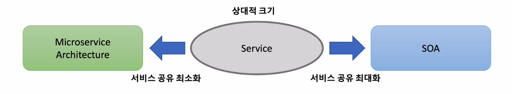
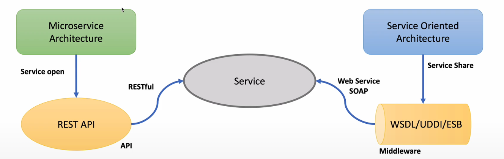
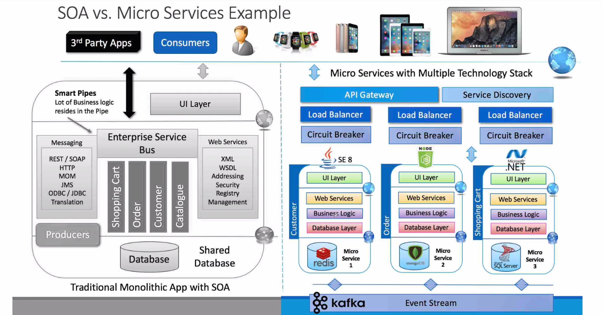
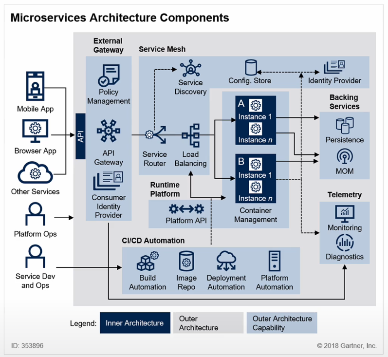
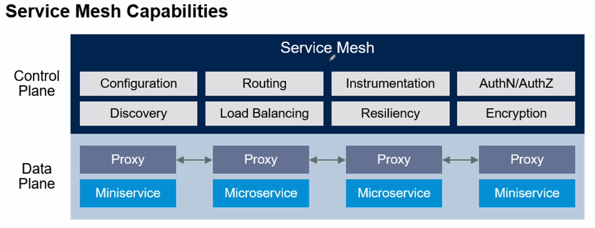
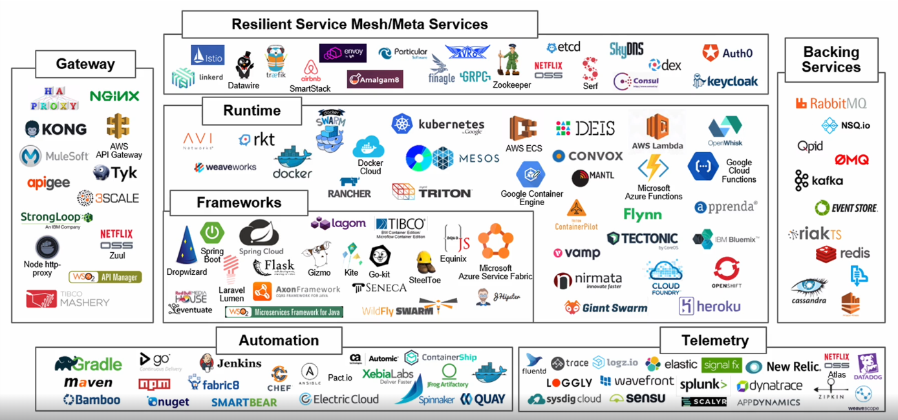

# Spring Clould로 개발하는 마이크로서비스 애플리케이션(MSA)

## Monolith
* 모든 업무 로직이 하나의 애플리케이션 형태로 패키지 되어 서비스
* 애플리케이션에서 사용하는 데이터가 한곳에 모여 참조되어 서비스되는 형태

단점 : 시스템의 일부만 수정해도 전체 어플리케이션을 다시 빌드, 테스트, 패키징 해야한다.

## Microservice
* HTTP 통신을 이용해서 리소스 API에 통신할수있는 작은 규모의 여러 서비스들의 묶음이 모여 하나의 어플리케이션을 구성
* 비즈니스 기능을 중심으로 구축, 자동화된 배포 시스템
* 최소한의 중앙 집중식

***
### 특징

1. Challenges
2. Samll well Chosen Deployable Units
3. Bounded Context 
4. RESTful
5. Configuration Management 
6. Cloud Enabled 
7. Dynamic Scale Up And Scale Down
8. CI/CD
9. Visibility

### Microservice 전환과 도입 할때 고려해야할 점
1. 어느정도 변화가 생길것인가?   
    - 기존 개발 대비 비용, 시간이 더 투자되어야함
2. 독립 라이프 사이클   
    - 어플리케이션을 구성하는 서비스들이 독립적으로 개발되고 운영될 수 있어야함
3. 독립적인 확장성   
    - 각각의 서비스를 운영함에 있어서 서비스 유지 보수 및 확장성이 가능 한가
    - 스케일링이 쉽게 되어있는가
4. 격리된 오류
    - 컴퓨터 소프트웨어는 오류가 발생하지 않을 수 없다. 이러한 오류 사항이 독립적인가
    - 서비스에 오류 발생시 다른 서비스에 영향을 최소한으로 받을 수 있나
5. 외부 종속성과의 상호작용 단순화
    - 시스템이나 서비스간의 종속성을 최소화하고
    - 반대로 응집력을 높일수 있도록 서비스 경계가 잘 구분 되어있는가
6. Polyglot
    - Polyglot이란 여러가지 프로그래밍 언어, 스토리지 기술을 사용할수 있게끔 지원하는 패러다임
    - 각각의 서비스의 기능에 맞는 프로그래밍 언어와 데이터베이스 운영환경을 자유롭게 선택할 수 있는가 

## SOA(Service Oriented Architecture)와 MSA의 차이점

- 서비스 공유 지향점
    - SOA - 재사용을 통한 비용절감
    - MSA - 서비스 간의 결합도를 낮추어 변화에 능동적으로 대응

- 기술 방식
    - SOA - 공통의 서비스를 ESB에 모아 사업 특면에서 공통 서비스 형식으로 서비스 제공
    - MSA - 각 독립된 서비스가 노출된 REST API 사용

### REST API
1. LEVEL 0
    - REST 스타일로 SOAP 서비스 노출
    - 예)
        - http://server/getPosts
        - http://server/deletePosts
2. LEVEL 1
    - 적절한 URI로 리소스를 노출
    - 예)
        - http://server/accounts
        - http://server/accounts/10
3. LEVEL 2
    - LEVEL 1 + HTTP Methods
    - 예)
        - http://server/accounts + GET (accounts 조회)
        - http://server/accounts + DELETE (accounts 삭제)
4. LEVEL 3
    - LEVEL 2 + HATEOAS
    - DATA + 다음에 가능한 Action들 포함됨
*** 
####  RESTful Web Service 설계 방법
- 해당 API 소비자 입장에서 간단, 명료, 직관적인 API 설계
- HTTP의 장점을 최대한 살린다
- HTTP Method 사용
    - get
    - post
    - put(patch)
    - delete
- 적절한 상태 코드 응답
    - 200 (정상)
    - 400 (클라이언트 오류)
    - 500 (서버 오류)
    - ... 등등
- 민감정보가 URI에 포함되면 안됨
- 복수 형태의 URI 사용
- 가능하면 명사 형태로 표현
    - 사용자에게 직관적임
- 일관적인 엔드포인트 사용

## Microservice Architecture

### 요청
1. 클라이언트 -> API Geteway 요청
2. Service Router -> Service Discovery 필요한 서비스 검색
3. Load Balancer를 통해 Instance에 요청

### 설정 정보
- Cloud Config Store 서비스를 통해 외부 시스템에 저장하는것이 일반적

### 배포
- CI/CD Automation 기술 사용

### Backing Services
- Microservice에 저장된 다양한 스토리지들을 모아서 사용할수 있는방법
- 메시징 처리 시스템을 통해 다른 서비스와 같이 연결될 수도 있음

### Telemetry
- Microservice들을 모니터링하고 진단 하는 기능들

## Service Mesh 

- Microservice Architecture의 Service Discovery, Router, API, Load Balancer을 포함한것
- Microservice Architecture를 적용한 시스템의 내부 통신을 말함
- Service Mesh를 통해 서비스 간의 통신을 추상화하고 안전하고 빠르고 신뢰성 있게 만들어주는 Infrastructure의 Layer
- 추상화를 통한 복잡한 내부 네트워크를 제어, 추적
- 내부 네트워크에 관련된 로직을 추가함으로써 안정성, 신뢰성, 탄력성, 표준성, 가시성, 보안성 등을 확보할 수 있음
- URI경로, Host Header, API Version, 기타 응용프로그램의 규칙을 기반으로 하는 Network Layer
- Service Mesh의 구체적인 경량화 Proxy를 통한 다양한 Routing 기능, Circuit Breaker등 공통기능 설정 가능

## MSA기반 기술

## Spring Cloud

- 환경설정
    - Spring Cloud Config Server
- Location Transparency
    - 서비스 등록, 위치정보 확인, 검색 등 
    - Naming Server (Netflix Eureka)
- Load Distribution(Load Balancing)
    - Ribbon (Client Side)
    - Spring Cloud Geteway
- Easier REST Clients
    - Microservice간의 통신
    - REST Template, FeignClient
- 시각화와 모니터링
    - Zipkin Distributed Tracing (분산 추적)
    - Netflix API Geteway
- 장애 회복
    - Hystrix
