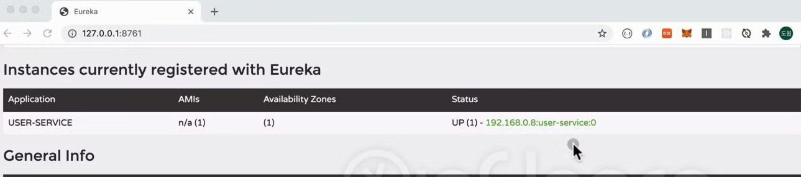
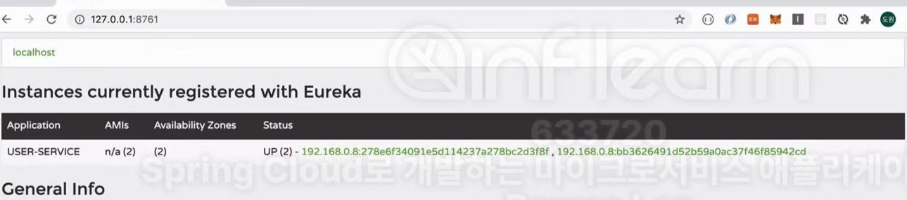

# 5주차 : Spring Cloud MSA #2

### 섹션2 : Service Discovery
<br/>

### Spring Cloud Netflix Eureka


하나의 마이크로 서비스가 3개의 인스턴스에서 구동되고 있다고 가정하자.  

- 하나의 서버에서 여러 개의 서비스를 동시에 구동하려면 각 인스턴스는 서로 다른 포트가 지정되어 있어야 할 것이다. (하나의 IP만 사용하는 경우)
- 만일 여러 대의 서버 혹은 각 인스턴스 별로 IP 주소가 다를 경우에는 같은 포트 번호를 사용해도 된다.

이렇게 서로 나눠져 있는 서비스들을 `Spring Cloud Netflix Eureka` 에 등록할 거다. `Spring Cloud Netflix Eureka`는  이전 주차에서 공부했던 `MSA의 기본 구성 요소` 중 하나인 `Service Discovery` 역할을 하게 된다. `Service Discovery`는  외부에서 다른 어떤 서비스가 마이크로 서비스들을 검색하기 위해 사용 된다 (전화번호부 같은 느낌).

### Eureka Service Discovery 프로젝트 생성

- `Spring Initializr`를 이용해 `Spring Cloud` 프로젝트를 생성한다. 이 때 `Spring Cloud Discovery`의 `Eureka Server` 의존성을 추가한다.
- 프로젝트의 `main 클래스` 상단에 `@EnableEurekaServer` 어노테이션을 추가해 이 서버가 `Service Discovery` 역할을 하도록 설정한다.
- 프로젝트 실행 후 `localhost:{포트번호}`로 접속했을 때 아래와 같은 화면이 등장하면 성공이다.
    
    
    

### 마이크로 서비스 프로젝트 생성

- `Service Discovery`에 등록할 마이크로 서비스 프로젝트를 생성한다. 이 때 아래에 작성된 의존성들을 추가한다.
    - Spring Boot DevTools : 개발 환경에서 프로젝트에 변동이 발생할 경우 서버를 Reload 시켜줌
    - Lombok : 자바 빈 프로퍼티 규약(Getter, Setter)을 지키는 과정에서 중복 코드를 줄여주는 플러그인
    - Eureka Discovery Client : `Service Discovery`에 등록하려는 서비스임을 나타내기 위함
    - Spring Web : 톰캣(WAS)를 포함시켜 프로젝트가 웹 애플리케이션 역할을 할 수 있도록 함
- 프로젝트의 `main 클래스` 상단에 `@EnableDiscoveryClient` 어노테이션을 추가해 이 서비스를 `Service Discovery` 에 등록할 것임을 설정한다.
- application.yml 파일 내부에 `Eureka Client` 관련 설정을 추가한다.
    
    ```yaml
    eureka:
    	client:
    		register-with-eureka: true # Service Discovery에 등록하겠다
    		fetch-registry: true # Eureka 서버로부터 등록되어 있는 인스턴스들의 정보를 주기적으로 가져올 것이다
    		service-url: # Eureka 서버의 주소
    			defaultZone: http://127.0.0.1:8761/eureka # 포트 번호는 설정에 따라 달라짐
    			
    # 프로젝트 설정
    server:
    	port: 9001
    spring:
    	application:
    		name: user-service # 프로젝트 이름
    ```
    
- Eureka 서버를 실행 중인 상태에서 서비스를 실행시킨다. Eureka 서버의 관리 콘솔로 접근해 서비스가 등록되었는지 확인한다.
    
    
    

### 마이크로 서비스 프로젝트 다중 실행

프로젝트 설정에서 포트를 9001로 설정했기 때문에 현재 상태에서는 여러 개의 서비스를 동시에 실행할 수 없다. 때문에 실행되는 마이크로 서비스마다 서로 다른 포트를 지정해줘야 한다.

1. 첫 번째 방법 - 환경 변수 설정
    
    기본 생성되어 있는 프로젝트 실행 Config 을 복제하여, VM Options 항목에 `-Dserver.port=9002` 명령을 추가한다. 이렇게 하면 프로젝트를 서로 다른 포트로 실행시킬 수 있다.
    
    
    
    maven 명령으로 직접 포트 번호를 지정해 실행 시킬 수도 있다.
    
    ```
    mvn spring-boot:run -Dspring-boot.run.jvmArguments='-Dserver.port=9003'
    ```
    
2. 두 번째 방법 - 랜덤 포트 방식 사용
    
    ```yaml
    server:
    	port: 0
    ```
    
    - application.yml에서 서버 포트를 0으로 설정하면 매번 프로젝트가 실행될 때마다 무작위 포트가 지정된다. 그러나 이 방식을 사용하면 Eureka 서버 콘솔에서 마이크로 서비스를 구분하기 어려워진다. 여러 프로젝트를 동시 실행하더라도 모두 0번 포트로 표시된다.
        
        
        
    - 이 방식을 보완하기 위해 마이크로 서비스 별로 인스턴스ID를 부여하도록 한다.
        
        ```yaml
        eureka:
        	instance: # 인스턴스 ID를 무작위 부여한다. hostname == IP, instance_id == random.value
        		instance-id: ${spring.cloud.client.hostname}:${spring.application.instance_id:${random.value}}
        ```
        
        
        
        Eureka 콘솔에서 확인했을 때 `Service Discovery` 에 올바르게 등록됨을 확인할 수 있다.