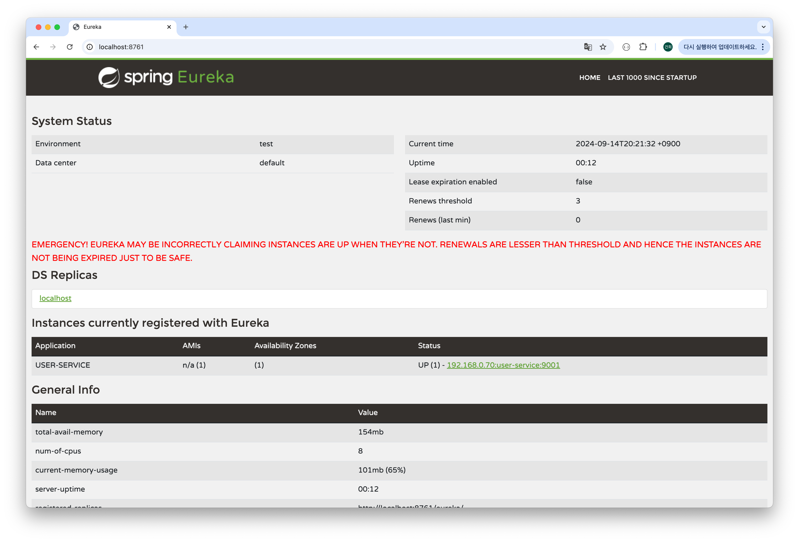
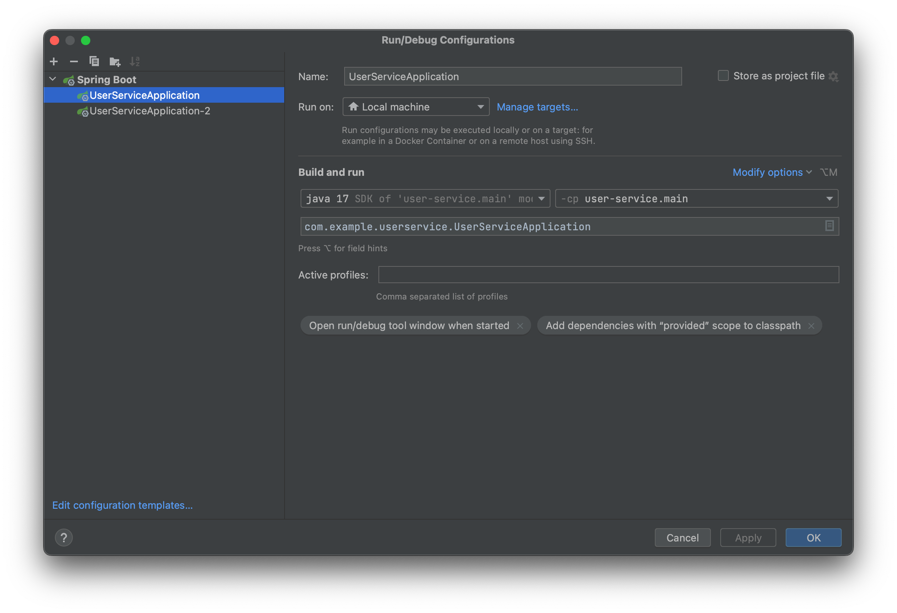

# 5주차

## Spring Cloud Netflex Eureka

### 서비스 디스커버리
- 외부에서 다른 서비스들이 마이크로 서비스를 검색하기 위해서 사용되는 개념.
- 정보는 키와 벨류 형식으로 저장되어 있다.

### eureka 프로젝트 생성 및 설정.
1. 프로젝트 생성시 eureka-server의존성 추가.
2. yml 파일에 다음 내용 추가
server:
  port: 8761

spring:
  application:
    name: discoveryname

eureka:
  client:
    register-with-eureka: false
    fetch-registry: false

3. 메인클레스에 @EnableEurekaServer 추가.

### userService 프로젝트 생성 및 설정.
1. 프로젝트 생성시 Spring Web, Spring Boot DevTools, Lombok, Eureka Discovery Client의존성 추가.
2. 메인클래스에 @EnableDiscoveryClient 추가.
3. yml 파일에 다음 내용 추가
server:
  port: 9001

spring:
  application:
    name: user-service

eureka:
  client:
    register-with-eureka: true
    fetch-registry: true  # 유레카 서버로부터 인스턴스들의 정보를 주기적으로 가져올지 설정하는 속성, true시 갱신된 정보를 받겠다는 뜻.
    service-url:
      defaultZone: http://127.0.0.1:8761/eureka

- 2개의 프로젝트를 실행시키고 http://localhost:8761 eureka Server 콘솔 페이지에 접속하면 
userService 프로젝트가 등록된 것을 확인할 수 있다.

### 하나의 프로젝트에서 여러개의 application 실행 방법
1. edit configuration에서 기존의 Applicatrrion을 복사한다.

2. 같은 포트를 사용하면 어플리케이션이 실행되지 않기 때문에 복사한 어플리케이션의 포트 번호를 vmOptions에서 '-Dserver.port=9002'와 같이 별도로 지정해준다.

- 이렇게 설정 후 2개의 어플리케이션을 실행하면 Eureca 콘솔 페이지에 2개의 어플리케이션이 작동되는 것을 확인할 수 있다.
- eureka 서비스 디렉터리 안에 2개의 유저서비스가 등록되어 있다. 이제 외부에서 유저 서비스로 클라이언트 요청이 전달된다고 하면, 서비스 안에서 어떠한 인스턴스로 전달될지 인스턴스의 정보를 게이트웨이나 라우팅 서비스에 전달해줌.

### 랜덤으로 포트번호 지정
- 위와 같은 방법으로 포트번호를 지정해서 실행시키는 방법은 여러개의 다중 어플리케이션을 실행시킬 때 조금은 번거로울 수 있다.
- yml파일에서 'server.port: 0'으로 지정해주면 Port번호를 랜덤하게 지정하겠다는 의미이다.
- 이렇게 설정 후 여러개의 어플리케이션을 동시에 실행시키면 유레카 콘솔에 하나의 목록만이 뜨는 것을 알 수 있다.
- 이를 해결하기 위해 yml파일에 'eureka.instance.instance-id: ${spring.cloud.client.hostname}:${spring.application.instance_id:${random.value}}' 내용을 추가해주면 유레카 콘솔에 서비스ip주소와 인스턴스 이름으로 목록이 분리되어 나오는 것을 확인할 수 있다.
