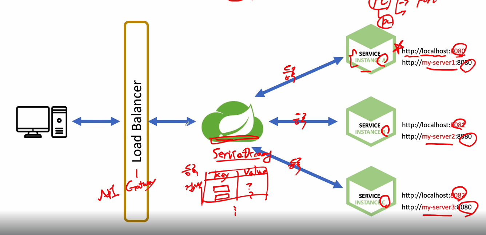

# Spring Clould로 개발하는 마이크로서비스 애플리케이션(MSA)

## Spring Cloud Netflix Eureka

### Service Discovery
Key-Value 형태의 어떠한 서버와, 서비스가 어느위치에있는지 등록



1. 유레카 서버에 서비스를 등록하는 작업
2. 클라이언트 로드벨런서, API Getway에 요청 정보 전달
3. Service Discovery에 검색후 반환


## Project

### DiscoveryService
프로젝트 생성시 Spring Cloud Discovey - Eureka Server Dependency 추가


#### yml 설정

```yml
spring:
  application:
    name: discoveryservice

server:
  port: 8761

eureka:
  client:
    register-with-eureka: false
    fetch-registry: false
```

#### DiscoveryserviceApplication 

```java
@EnableEurekaServer
```
어노테이션 추가 


### UserService
실질적인 서비스  
프로젝트 생성시 Spring Cloud Discovey - Eureka Discovery Client 추가, 그외 필요한 Dependency들 추가


#### yml

```yml
server:
  port: 0 # Random port

spring:
  application:
    name: user-service

eureka:
  instance:
    instance-id: ${spring.cloud.client.hostname}:${spring.application.instance_id:${random.value}}  

  client:
    fetch-registry: true
    register-with-eureka: true
    service-url:
      defaultZone: http://localhost:8761/eureka
```

#### UserserviceApplication
```java
@EnableDiscoveryClient
```
어노테이션 추가