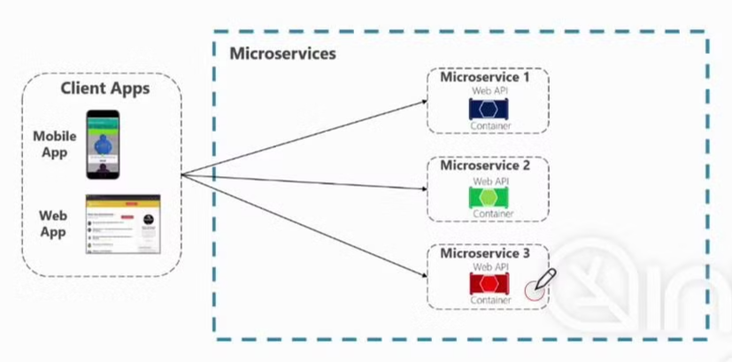
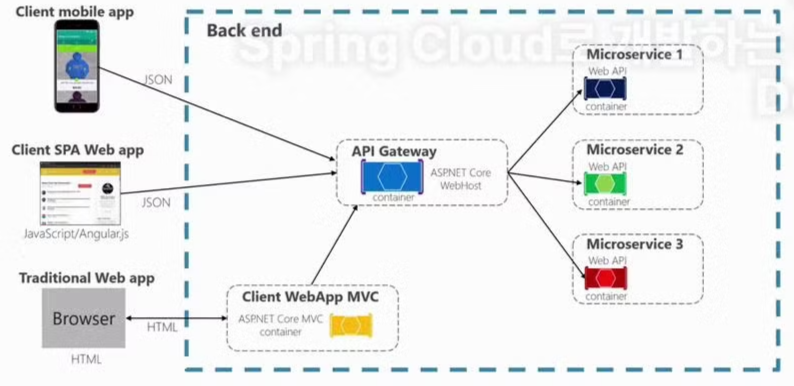
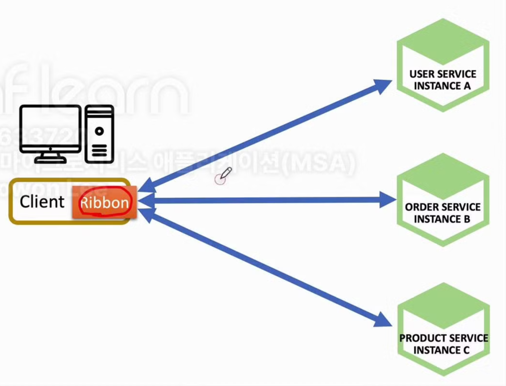
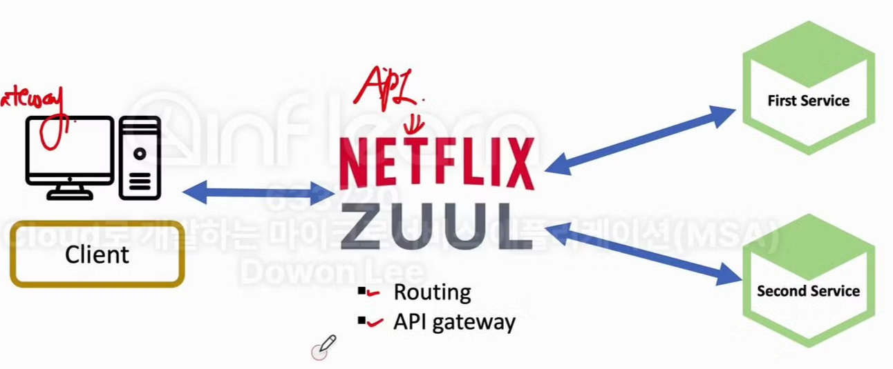
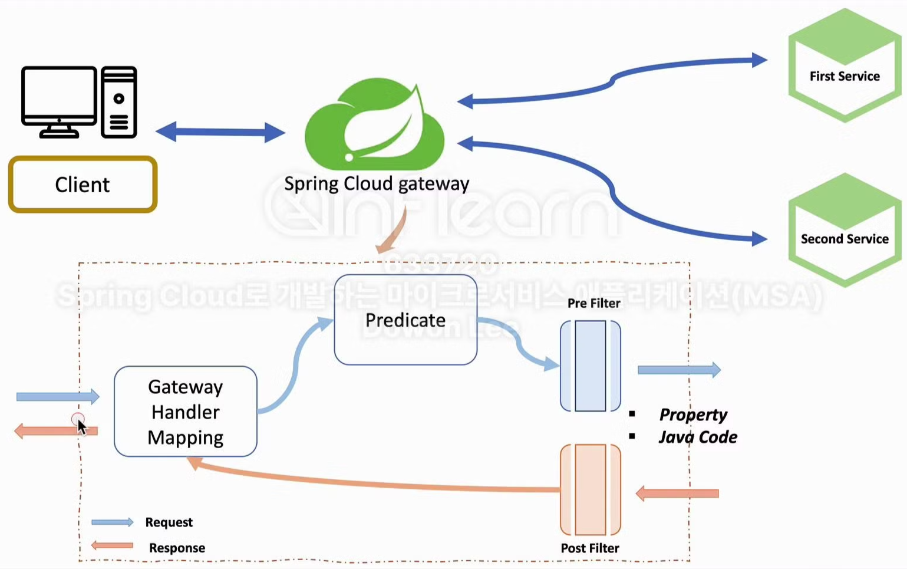

# 6주차 : Spring Cloud MSA #3

## 섹션3 : API Gateway Service

<br/>

### API Gateway Service의 역할

사용자가 설정한 라우팅 설정에 따라 각각의 엔드포인트로 클라이언트를 대신해서 요청하고, 응답을 받으면 다시 클라이언트에게 전달해주는 `proxy` 역할을 한다.

시스템의 내부 구조는 숨기고 외부의 요청에 대해서 적절한 형태로 가공해서 응답할 수 있다는 장점을 갖고 있다.

- 마이크로 서비스가 3개 있다고 가정 했을 때, 클라이언트 사이드에서 마이크로 서비스를 직접 호출하는 구조를 갖게 될 경우 새로운 마이크로 서비스가 추가되거나, 기존의 마이크로 서비스의 IP주소가 변경되는 등의 변동사항이 발생하면 클라이언트 사이드도 다시 수정/배포가 되어야 한다. (엔드포인트 정보가 바뀌므로)
    
    
    
- 위의 단점을 보완하기 위해 서비스로의 단일 진입점을 갖고 있는 형태로 개발하는 방식이 필요하게 되었다. 
여기서 클라이언트와 마이크로 서비스 사이에 중간 게이트웨이 역할을 해주는 것이 바로 `API Gateway Service`다. `Gateway` 한 곳에서 여러 마이크로 서비스의 엔드포인트 정보를 관리하는 작업이 훨씬 더 간편하고 효율적이다.
    
    
    
- API Gateway Service 사용의 이점
    - 인증 및 권한 부여
    - 서비스 검색 통합
    - 응답 캐싱
    - 정책, 회로 차단기 및 QoS 다시 시도
    - 속도 제한
    - 부하 분산 (로드 밸런싱)
    - 로깅, 추적, 상관 관계
        - 각각의 마이크로 서비스에서 로깅을 수행하지 않고 `API Gateway`에서 로깅을 담당하도록 구현하면 간편하다
    - 헤더, 쿼리 문자열 및 청구 변환
    - IP 허용 목록에 추가

<br/>

### Spring Cloud에서의 MSA 간 통신 방법

- RestTemplate
    
    가장 전통적으로 많이 사용되던 서버 사이드 HTTP 클라이언트
    
    ```java
    RestTemplate restTemplate = new RestTemplate();
    restTemplate.getForObject("http://localhost:8080/", User.class, 200);
    ```
    
- Feign Client
    
    스프링 클라우드에서 사용되는 API 클라이언트. 다른 마이크로 서비스에 HTTP 요청을 보내고자 할 때 서버의 주소나 포트 번호 없이 마이크로 서비스의 이름을 가지고 호출할 수 있다.
    
    ```java
    @FeignClient("stores")
    public interface StoreClient {
    	@RequestMapping(method = RequestMethod.GET, value="/stores")
    	List<Store> getStores();
    }
    ```
    

<br/>

### Netflix Ribbon

스프링 클라우드에서는 로드 밸런서 역할을 해주는 별도의 서비스인 `Ribbon`을 제공한다. 과거 Netflix에서 개발하여 스프링 재단에 기부 했지만, 비동기 처리가 불가능하다는 단점이 있어 현재는 잘 사용 되지 않는다.



`Ribbon`은 `API Gateway` 역할을 하는 서비스를 별도로 구축하지 않고 클라이언트 측 자체적으로 `Gateway 역할`을 할 수 있도록 구축할 수 있다. `Ribbon`은 클라이언트 사이드 로드 밸런서다.

<br/>

### Netflix Zuul



Netflix에서 개발한 `API Gateway Service`이다. 최신 버전의 `Spring Cloud` 에서는 이제 사용되지 않고, `Spring Cloud Gateway`로 그 기능을 대체할 수 있다.

<br/>

### Spring Cloud Gateway

`Ribbon`, `Zuul`은 비동기 처리가 불가능하다는 큰 단점이 있었기에 최신 트렌드에 맞게 기능을 변형한 `Spring Cloud Gateway`가 개발되었다. 



- Gateway
    
    클라이언트로부터 요청 정보를 받음
    
- Predicate
    
    요청 정보를 토대로 어느 마이크로 서비스로 요청을 proxy 시킬지 판단 (조건 분기)
    
- Filter
    - Pre Filter (사전 필터) : proxy 작업 이전 동작
    - Post Filter (사후 필터) : proxy 작업 이후 동작
    - Filter 등록 방식으로는 property(.yml)을 통해 작성하거나 Java 코드 자체적으로 작성하는 방식이 있다.

<br/>

### Filter 등록 방식 - Java 코드

```java
@Configuration
public class FilterConfig {
    @Bean
    public RouteLocator gatewayRoutes(RouteLocatorBuilder builder) {
        return builder.routes()
                .route(r -> r.path("/first-service/**")
                        .filters(f -> f.addRequestHeader("first-request", "first-request-header")
				                                .addResponseHeader("first-response", "first-response-header"))
                        .uri("http://localhost:8081"))
                .route(r -> r.path("/second-service/**")
                        .filters(f -> f.addRequestHeader("second-request", "second-request-header")
				                                .addResponseHeader("second-response", "second-response-header"))
                        .uri("http://localhost:8082"))
                .build();
    }
}
```

.path() 로 요청이 발생하면 .filters()로 사전 필터와 사후 필터를 추가한다. 위 코드에서는 필터를 통해 응답, 요청 Header에 값을 추가시켰다. 필터 추가 후 .uri() 속 주소로 요청을 proxy 시킨다.

<br/>

### Filter 등록 방식 - .yml

```java
spring:
  cloud:
    gateway:
      routes:
        - id: first-service
          uri: http://localhost:8081
          predicates:
            - Path=/first-service/**
          filters:
            - AddRequestHeader=first-request, first-request-header
            - AddResponseHeader=first-response, first-response-header
        - id: second-service
          uri: http://localhost:8082
          predicates:
            - Path=/second-service/**
          filters:
            - AddRequestHeader=second-request, second-request-header
            - AddResponseHeader=second-response, second-response-header
```

- id : 라우팅 id
- uri : 라우팅 시킬 uri
- predicates : 조건 분기
- filters : 사전, 사후 필터 추가