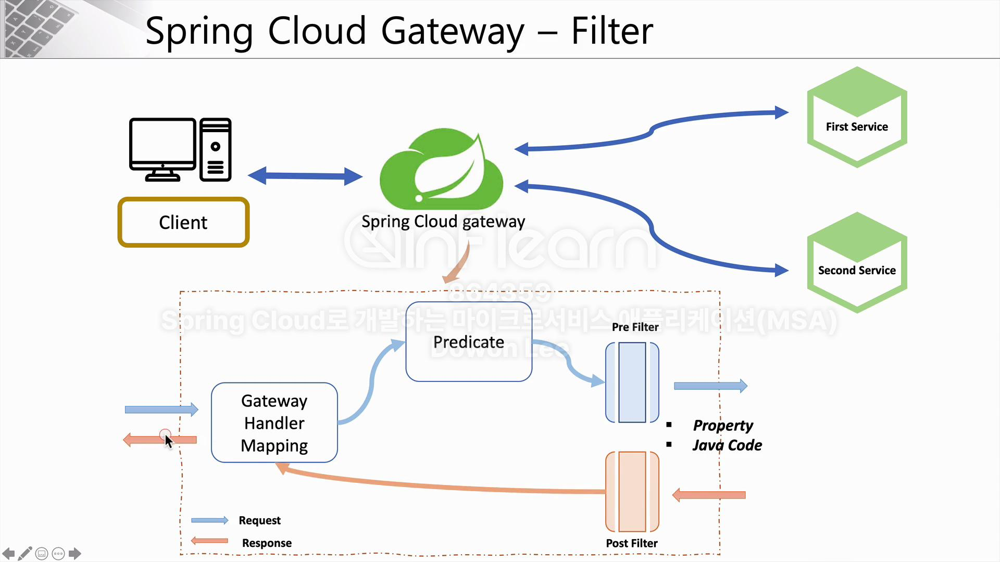

# 6주차

### API Gateway Service
- 사용자가 설정한 라우팅 설정에 따라 각각 엔드포인트로 클라이언트를 대신해 요청하고 응답을 받는 프록시 역할.
- 시스템 내부의 구조를 숨기고 외부에 요청에 따라 적절한 형태로 가공해 응답할 수 있는 장점이 있다.
- 직접적으로 마이크로 서비스를 호출하지 않고 게이트웨이를 통해 각각의 서비스를 호출
- 마이크로 서비스가 추가되거나 기존의 서비스의 요청 주소, 파라미터가 변경되었을 때의 대응이 편해진다.
- API 게이트웨이 사용 목적
    - 인증 및 권한 부여
    - 서비스 통합 검색
    - 응답 캐싱
    - 정책, 회로 차단기 및 QoS 다시 시도
    - 속도 제한
    - 부하 분산
    - 로깅, 추적, 상관 관계
    - 헤더, 쿼리 문자열 및 청구 변환
    - IP허용 목록에 추가

### Netflix Ribbon
- 스프링 클라우드에서 로드 밸런서 역할 하는 서비스.
- 비동기 처리가 불가능 함.
- 클라이언트 사이드 로드 밸런서이다.

### Netflix Zuul
- API Gateway 서비스, 최신 버전에서는 사용이 불가.
- Spring Cloud Gateway로 해당 기능을 사용할 수 있다.

### Spring Cloud Gateway

### FILTER
- Predicate : 조건 분기
- Pre Filter(사전 필터), Post Filter(사후 필터)

- 필터의 등록은 Java코드에서와 yml파일에서 가능하다.


- java코드로 등록

```java
@Configuration
public class FilterConfig {

    @Bean
    public RouteLocator gatewayRoutes(RouteLocatorBuilder builder) {
        return builder.routes()
                .route(r -> r.path("/first-service/**")  // 1. 사용자로부터 서비스 요청이 들어옴
                        .filters(f -> f.addRequestHeader("first-request", "first-request-header")           //3. 중간에 필터에 추가하고 반환할 값을 추가.
                                      .addResponseHeader("first-response", "first-response-header"))
                        .uri("http://localhost:8081"))   // 2. 해당 경로로 이동할 건데
                .route(r -> r.path("/second-service/**")  // 1. 사용자로부터 서비스 요청이 들어옴
                .filters(f -> f.addRequestHeader("second-request", "second-request-header")           //3. 중간에 필터에 추가하고 반환할 값을 추가.
                        .addResponseHeader("second-response", "second-response-header"))
                .uri("http://localhost:8082"))   // 2. 해당 경로로 이동할 건데
                .build();
    }
}
```
- yml로 등록
```java
spring:
  application:
    name: apigateway-service
  cloud:
    gateway:
      routes:
        - id: first-service
          uri: http://localhost:8081/
          predicates:
            - Path=/first-service/**
          filters:
            - AddRequestHeader=first-request, first-requests-header2
            - AddResponseHeader=first-response, first-response-header2
        - id: second-service
          uri: http://localhost:8082/
          predicates:
            - Path=/second-service/**
          filters:
            - AddRequestHeader=second-request, second-requests-header2
            - AddResponseHeader=second-response, second-response-header2
```

## 정리
- Api gateway를 사용하면 1번 서비스와 2번 서비스가 있을 때 클라이언트는 각각의 서비스의 주소나 포트번호를 몰라도 이름으로 해당 서비스에 요청을 보내고 받을 수 있다.

- 요청을 보낼때 filter를 사용하여 헤더에 필요한 값을 넣어서 보내고 응답받을 수 있다. 

- 실습을 해보면서 aws의 loadBalancer와 같은 개념이라는 것을 알게되었다.