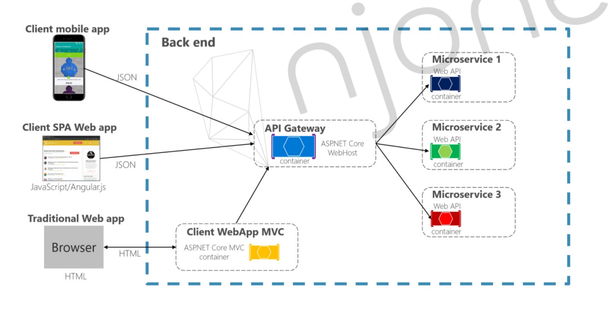
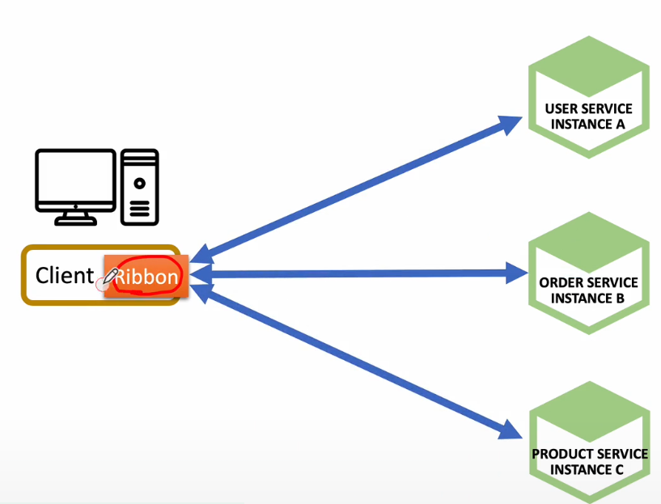
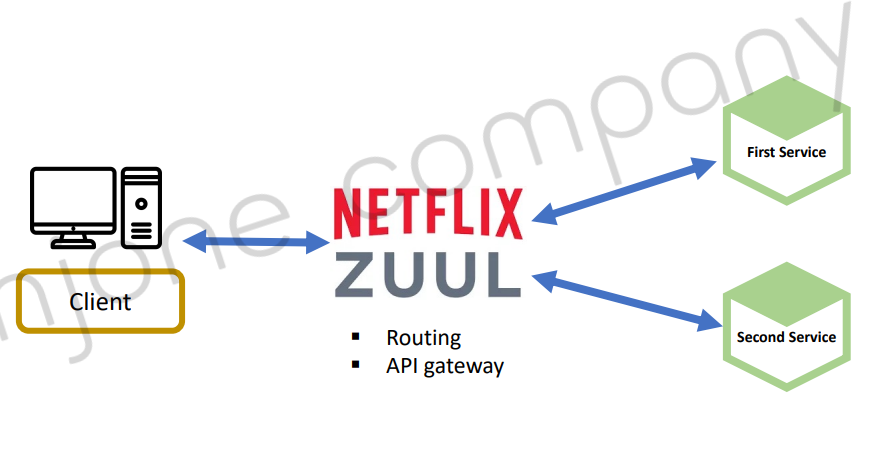
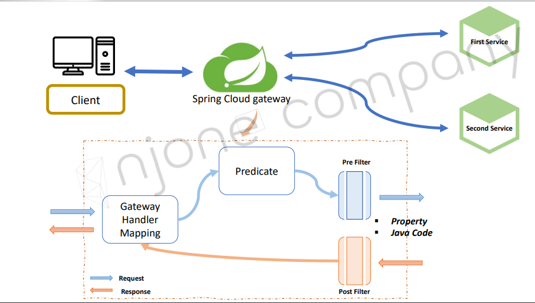

# API Geteway Service


- 인증 및 권한 부여
- 서비스 검색 통합
- 응답 캐싱
- 정책, 회로 차단기 및 QoS 다시시도
- 속도 제한
- 부하 분산
- 로깅, 추적, 상관 관계
- 헤더, 쿼리 문자열 및 청구 변환
- IP 허용 목록에 추가

## Netflix Ribbon
1. RestTemplate 
2. Feign Client


- Ribbon : Client side Load Balancer
    - 서비스 이름으로 호출
    - Health Check
    - 비동기처리 X


## Netflix Zuul



## Spring Cloud Geteway


- Predicate: 조건분기
    - 사용자 요청 정보를 받아 판단해 분기

- Filter
    - Pre Filter 
        - 작업을 시작하기 전 호출되는 필터
    - Post Filter
        - 작업이 끝난 후 호출되는 필터

### Spring Cloud Gateway 라우팅 방법
```yml
spring:
  cloud:
    gateway:
        routes:
            - id: first-service
            uri: http://localhost:8081/
            predicates:
                - Path=/first-service/**
            - id: second-service
            uri: http://localhost:8082/
            predicates:
                - Path=/second-service/**
```

### Filter 사용하기

RouteLocator를 사용하여 Bean을 등록하면 yml에 등록한 라우트 정보를 Java 코드로 등록할수있다.

```java
    @Bean
    public RouteLocator gatewayRoutes(RouteLocatorBuilder builder) {
        return builder.routes()
                .route(r -> r.path("/first-service/**")
                        .filters(f -> f.addRequestHeader("first-request", "first-request-header")
                                .addResponseHeader("first-response", "first-response-header"))
                        .uri("http://localhost:8081/"))
                .route(r -> r.path("/second-service/**")
                        .filters(f -> f.addRequestHeader("second-request", "second-request-header")
                                .addResponseHeader("second-response", "second-response-header"))
                        .uri("http://localhost:8082/"))
                .build();
    }
```
- route(r -> r.path("/first-service/**")) 
    - /first-service/** 경로로 들어오는 모든 요청은
- .filters(f -> f.addRequestHeader("first-request", "first-request-header")
                                .addResponseHeader("first-response", "first-response-header"))
    - RequestHeader에 <"first-requst", "firest-request-header"> 추가
    - ResponseHeader에 <"first-response", "firest-response-header"> 추가
- .uri("http://localhost:8081/"))
    - http://localhost:8081 경로로 보내진다.

여기서 addRequestHeader()는 위에 설명한 Pre Filter, addReponseHeader는 Post Filter가 된다.

### YML 사용하여 필터 적용 
```yml
  cloud:
    gateway:
      routes:
        - id: first-service
          uri: http://localhost:8081/
          predicates:
            - Path=/first-service/**
          filters:
            - AddRequestHeader=first-request, first-request-header
            - AddResponseHeader=first-response, first-response-header
        - id: second-service
          uri: http://localhost:8082/
          predicates:
            - Path=/second-service/**
          filters:
            - AddRequestHeader=second-request, second-request-header
            - AddResponseHeader=second-response, second-response-header
```

filters: 를 이용해 사용한다. 내용은 위와 같다.