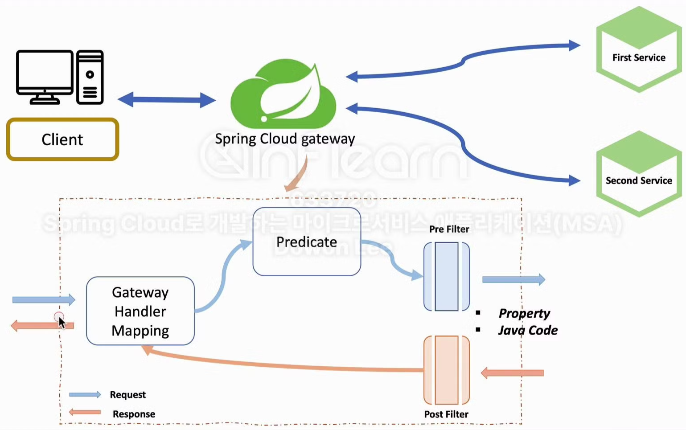
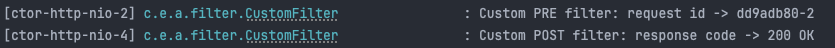
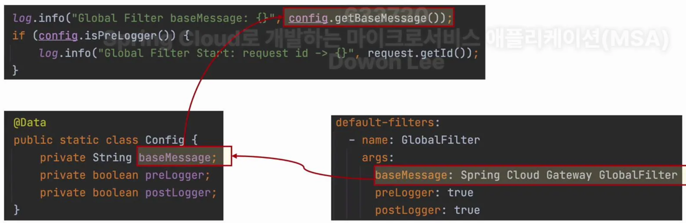
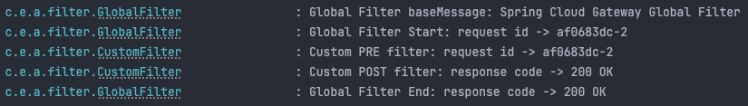

# 7주차 : Spring Cloud MSA #4

### 섹션3 : API Gateway Service

## 복습 - Spring Cloud Gateway 동작 구조



- Gateway
    
    클라이언트로부터 요청 정보를 받음
    
- Predicate
    
    요청 정보를 토대로 어느 마이크로 서비스로 요청을 proxy 시킬지 판단 (조건 분기)
    
- Filter
    - Pre Filter (사전 필터) : proxy 작업 이전 동작
    - Post Filter (사후 필터) : proxy 작업 이후 동작
    - Filter 등록 방식으로는 property(.yml)을 통해 작성하거나 Java 코드 자체적으로 작성하는 방식이 있다.

## Custom Filter 적용

Custom Filter는 말 그대로 사용자 정의 필터라고 생각하면 된다. 지난 주차에서 구현한 HTTP 헤더에 값을 추가하는 식의 정해져있는 액션이 아닌, 로그를 출력하거나 인증을 처리하는 등의 기능을 자유롭게 정의할 수 있는 필터라고 이해하면 된다.

```java
// CustomFilter.java
@Component
@Slf4j
public class CustomFilter extends AbstractGatewayFilterFactory<CustomFilter.Config> {
// CustomFilter는 반드시 AbstractGatewayFilterFactory를 상속받아야 한다.
// Config 정보가 있다면 자신의 클래스 안에서 Config라는 내부 클래스를 매개변수로 등록한다.

    public CustomFilter() {
        super(Config.class);
    }

    public static class Config {
        // Config 정보
    }

    @Override
    public GatewayFilter apply(Config config) {
        // Custom Pre Filter
        return (exchange, chain) -> { // exchange, chain -> 게이트웨이 필터
            // Netty를 사용하므로 ServerHttpXxx 타입
            ServerHttpRequest request = exchange.getRequest();
            ServerHttpResponse response = exchange.getResponse();

            log.info("Custom PRE filter: request id -> {}", request.getId());

            // Custom Post Filter (모든 처리가 끝난 후)
            return chain.filter(exchange).then(Mono.fromRunnable(() -> { // Mono.fromRunnable() -> 비동기 작업을 수행할 때 사용
                log.info("Custom POST filter: response code -> {}", response.getStatusCode());
            }));
        };
    }
}
```

```yaml
....

spring:
  application:
    name: apigateway-service
  cloud:
    gateway:
      routes:
        - id: first-service
          uri: http://localhost:8081
          predicates:
            - Path=/first-service/**
          filters:
          # 이전에 등록했던 필터 주석 처리
          
#            - AddRequestHeader=first-request, first-request-header
#            - AddResponseHeader=first-response, first-response-header
            - CustomFilter # CustomFilter 등록
        - id: second-service
          uri: http://localhost:8082
          predicates:
            - Path=/second-service/**
          filters:
#            - AddRequestHeader=second-request, second-request-header
#            - AddResponseHeader=second-response, second-response-header
            - CustomFilter # CustomFilter 등록
```

### 실행 결과



## Global Filter 적용

GlobalFilter는 어떤 라우트건 공통적으로 적용할 수 있는 필터라고 생각하면 된다. CustomFilter는 매 조건 분기(predicates)마다 개별적으로 등록해야 한다는 번거로움이 있다. 만일 공통적으로 적용할 필터가 필요할 경우 GlobalFilter를 적용하면 된다.

```java
// GlobalFilter.java
@Component
@Slf4j
public class GlobalFilter extends AbstractGatewayFilterFactory<GlobalFilter.Config> {
    public GlobalFilter() {
        super(Config.class);
    }

		@Data
    public static class Config { // Config 정보
        private String baseMessage;
        private boolean preLogger; // pre 로그를 쓸 것인지
        private boolean postLogger; // post 로그를 쓸 것인지
    }

    @Override
    public GatewayFilter apply(GlobalFilter.Config config) {
        return ((exchange, chain) -> {
            ServerHttpRequest request = exchange.getRequest();
            ServerHttpResponse response = exchange.getResponse();

            log.info("Global Filter baseMessage: {}", config.getBaseMessage());

            if (config.isPreLogger()) {
                log.info("Global Filter Start: request id -> {}", request.getId());
            }

            return chain.filter(exchange).then(Mono.fromRunnable(() -> {
                if (config.isPostLogger()) {
                    log.info("Global Filter End: response code -> {}", response.getStatusCode());
                }
            }));
        });
    }
}
```

```yaml
spring:
  application:
    name: apigateway-service
  cloud:
    gateway:
	    # GlobalFilter 적용
      default-filters:
        - name: GlobalFilter
          args: # Config 값을 지정
            baseMessage: Spring Cloud Gateway Global Filter
            preLogger: true
            postLogger: true
      
      routes:
        - id: first-service
          uri: http://localhost:8081
          predicates:
            - Path=/first-service/**
          filters:
            - CustomFilter
        - id: second-service
          uri: http://localhost:8082
          predicates:
            - Path=/second-service/**
          filters:
            - CustomFilter
```



### 실행 결과



GlobalFilter가 모든 필터 중 가장 처음으로 시작되고 가장 마지막으로 종료되는 것을 볼 수 있다.