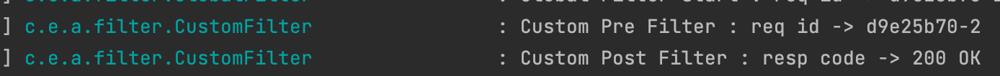
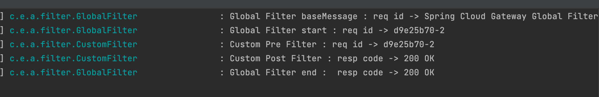
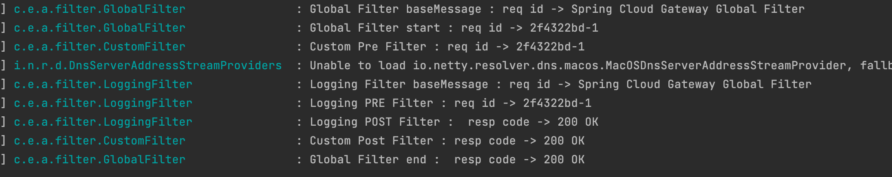
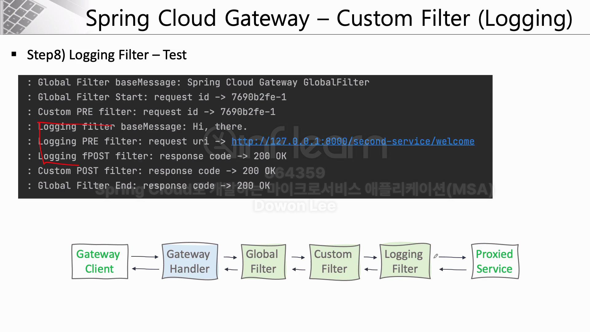

# 7주차

# Custom Filter (사용자 정의 필터)
### 로그 출력, 사용자 인증 처리 등을 커스텀 필터에 등록하여 사용 가능.
- 먼저 커스텀 필터 선언
- 커스텀 필터는 반드시 AbstractGatewayFilterFactory를 상속 받아양 함.

- apply 메서드를 구현해야 한다.
    - 작동하고자 하는 내용을 기술함.

    - 반환 형식은 exchange, filter형식
    - exchange객체를 통해 req, resp객체를 가져올 수 있음.

    ``` java
    // apigateway service
    @Component
    @Slf4j
    public class CustomFilter extends AbstractGatewayFilterFactory<CustomFilter.Config> {

        public CustomFilter() {
            super(Config.class);
        }

        public static class Config {
            // Put the Configuration properties
        }

        @Override
        public GatewayFilter apply(Config config) {
            // Custom pre filter
            return ((exchange, chain) -> {
                ServerHttpRequest request = exchange.getRequest();
                ServerHttpResponse response = exchange.getResponse();

                log.info("Custom Pre Filter : req id -> {}", request.getId());

                // Custom post filter
                return chain.filter(exchange).then(Mono.fromRunnable(() -> {
                    log.info("Custom Post Filter : resp code -> {}", response.getStatusCode());
                }));
            });
        }
    }
    ```
    ``` apigateway service yml
    spring:
    application:
        name: apigateway-service
    cloud:
        gateway:
        routes:
            - id: first-service
            uri: http://localhost:8081/
            predicates:
                - Path=/first-service/**
            filters:
                #- AddRequestHeader=first-request, first-requests-header2
                #- AddResponseHeader=first-response, first-response-header2
                - CustomFilter
            - id: second-service
            uri: http://localhost:8082/
            predicates:
                - Path=/second-service/**
            filters:
                #- AddRequestHeader=second-request, second-requests-header2
                #- AddResponseHeader=second-response, second-response-header2
                - CustomFilter
    ```
    ``` java first service
    @GetMapping("/check")
    public String check() {
        return "Hi, there. This is a message from First Service";
    }
    ```
    - 위에 내용을 구현하고 service서버와 gateway서버를 구동후 요청을 보내면 gateway서버 로그에 정상적으로 custom filter가 작동을 하는 것을 확인할 수 있다.


# Global Filter
- 공통적으로 다 시행될 수 있는 필터.
- 커스텀 필터와 동일하게 제작.
- 글로벌 필터는 과정 상 제일 먼저 실행되고 마지막에 종료된다.

``` java
// apigateway service
@Component
@Slf4j
public class GlobalFilter extends AbstractGatewayFilterFactory<GlobalFilter.Config> {

    public GlobalFilter() {
        super(Config.class);
    }

    @Data
    public static class Config {
        // Put the Configuration properties
        private String baseMessage;
        private boolean preLogger;
        private boolean postLogger;
    }

    @Override
    public GatewayFilter apply(Config config) {
        // Custom pre filter
        return ((exchange, chain) -> {
            ServerHttpRequest request = exchange.getRequest();
            ServerHttpResponse response = exchange.getResponse();

            log.info("Global Filter baseMessage : req id -> {}", config.getBaseMessage());

            if (config.isPreLogger())
                log.info("Global Filter start : req id -> {}", request.getId());

            return chain.filter(exchange).then(Mono.fromRunnable(() -> {
                if (config.isPostLogger())
                    log.info("Global Filter end :  resp code -> {}", response.getStatusCode());
            }));
        });
    }
}

```
``` apigateway service yml
spring:
  application:
    name: apigateway-service
  cloud:
    gateway:
      default-filters:
        - name: GlobalFilter
          args:
            baseMessage: Spring Cloud Gateway Global Filter
            preLogger: true
            postLogger: true
```

- 글로벌 필터를 적용 후 요청을 보내면 커스텀 필터가 작동되기 전에 먼저 작동되고, 커스텀 필터가 종료되면 글로벌 필터가 종료되는 것을 볼 수 있다.


# Logging Filter
- 커스텀 필터와 비슷한 개념.
- 우선 순위를 지정할 수 있다.

``` java
// apigateway service
@Component
@Slf4j
public class LoggingFilter extends AbstractGatewayFilterFactory<LoggingFilter.Config> {

    public LoggingFilter() {
        super(Config.class);
    }

    @Data
    public static class Config {
        // Put the Configuration properties
        private String baseMessage;
        private boolean preLogger;
        private boolean postLogger;
    }

    @Override
    public GatewayFilter apply(Config config) {
        GatewayFilter filter = new OrderedGatewayFilter((exchange, chain) -> {
            ServerHttpRequest request = exchange.getRequest();
            ServerHttpResponse response = exchange.getResponse();

            log.info("Logging Filter baseMessage : req id -> {}", config.getBaseMessage());

            if (config.isPreLogger())
                log.info("Logging PRE Filter : req id -> {}", request.getId());

            return chain.filter(exchange).then(Mono.fromRunnable(() -> {
                if (config.isPostLogger())
                    log.info("Logging POST Filter :  resp code -> {}", response.getStatusCode());
            }));
        }, Ordered.LOWEST_PRECEDENCE);  // 2번째 매게값으로 우선순위 지정. 'Ordered.LOWEST_PRECEDENCE' 낮음, 'HIGHEST_PRECEDENCE' 높음.

        return filter;
    }
}
```
``` apigateway service yml
  cloud:
    gateway:
      default-filters:
        - name: GlobalFilter
          args:
            baseMessage: Spring Cloud Gateway Global Filter
            preLogger: true
            postLogger: true
      routes:
        - id: first-service
          uri: http://localhost:8081/
          predicates:
            - Path=/first-service/**
          filters:
            #- AddRequestHeader=first-request, first-requests-header2
            #- AddResponseHeader=first-response, first-response-header2
            - CustomFilter
        - id: second-service
          uri: http://localhost:8082/
          predicates:
            - Path=/second-service/**
          filters:
            #- AddRequestHeader=second-request, second-requests-header2
            #- AddResponseHeader=second-response, second-response-header2
            - name : CustomFilter
            - name : LoggingFilter
              args :
                baseMessage: Spring Cloud Gateway Global Filter
                preLogger: true
                postLogger: true
```

- 확인을 위해 2번째 서비스에만 로깅을 등록하였다.


- 전체적인 작동 원리는 다음과 같다.
