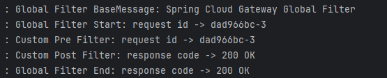
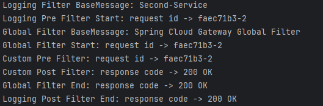

# Spring Cloud Gateway - Filter

## Custom Filter
```java
@Component
@Slf4j
public class CustomFilter extends AbstractGatewayFilterFactory<CustomFilter.Config> {

    public CustomFilter() {super(Config.class);}

    @Override
    public GatewayFilter apply(Config config) {
        // Custom Pre Filter
        return (exchange, chain) -> {
            ServerHttpRequest request = exchange.getRequest();
            ServerHttpResponse response = exchange.getResponse();

            log.info("Custom Pre Filter: request id -> {}", request.getId());

            // Custom Post Filter
            return chain.filter(exchange).then(Mono.fromRunnable(() -> {
                log.info("Custom Post Filter: response code -> {}", response.getStatusCode());
            }));
        };
    }

    public static class Config {

    }
}
```

customFilter를 만들때에는 AbstractGatewayFilterFactory를 상속받아 만들어야 한다.  
PreFilter는 chain.filter(exchange) 이전에 실행되고
PostFilter는 chain.filter(exchange) 이후에 실행된다.
Mono.fromRunnable()을 통해 비동기적으로 Post Filter를 수행할수있다.

```yml
spring:
  application:
    name: apigateway-service
  cloud:
    gateway:
      routes:
        - id: first-service
          uri: http://localhost:8081/
          predicates:
            - Path=/first-service/**
          filters:
#            - AddRequestHeader=first-request, first-request-header
#            - AddResponseHeader=first-response, first-response-header
            - CustomFilter
        - id: second-service
          uri: http://localhost:8082/
          predicates:
            - Path=/second-service/**
          filters:
#            - AddRequestHeader=second-request, second-request-header
#            - AddResponseHeader=second-response, second-response-header
            - CustomFilter
```

CustomFilter를 적용하는 방법은 yml에서 filters: 항목에 추가하여 적용할수 있다.

## GlobalFilter

위에서 적용한 CustomFilter는 개별적으로 원하는 서비스마다 직접 지정해준 방면  
GlobalFilter는 서비스 전체적으로 Filter를 적용할수있다.  

```java
@Component
@Slf4j
public class GlobalFilter extends AbstractGatewayFilterFactory<GlobalFilter.Config> {

    public GlobalFilter() {super(Config.class);}

    @Override
    public GatewayFilter apply(Config config) {
        // Custom Pre Filter
        return (exchange, chain) -> {
            ServerHttpRequest request = exchange.getRequest();
            ServerHttpResponse response = exchange.getResponse();

            log.info("Global Filter BaseMessage: {}", config.getBaseMessage());
            
            if (config.isPreLogger()) 
                log.info("Global Filter Start: request id -> {}", request.getId());
            
            // Custom Post Filter
            return chain.filter(exchange).then(Mono.fromRunnable(() -> {
                if (config.isPostLogger())
                    log.info("Global Filter End: response code -> {}", response.getStatusCode());

            }));
        };
    }

    @Data
    public static class Config {
        private String baseMessage;
        private boolean preLogger;
        private boolean postLogger;
    }
}
```
CustomFilter와 작성방식은 똑같다.  
Config에 원하는 환경설정을 하여 필요한 정보를 설정할수있다.(CustomFilter도 동일)  

```yml
spring:
  application:
    name: apigateway-service
  cloud:
    gateway:
      default-filters:
        - name: GlobalFilter
          args:
            baseMessage: Spring Cloud Gateway Global Filter
            preLogger: true
            postLogger: true
```
GlobalFilter는 default-filters: 항목에 작성하여 적용할수있다.  
args: 항목에 이전에 환경설정 정보를 yml로 적용 시켜줄수있다.  

### 결과
  
GlobalFilter 적용시 먼저 적용한 Custom Filter보다 먼저 실행되고 늦게 끝나는 것을 알수있다.

## LoggingFilter 

```java
@Component
@Slf4j
public class LoggingFilter extends AbstractGatewayFilterFactory<LoggingFilter.Config> {

    public LoggingFilter() {super(Config.class);}

    @Override
    public GatewayFilter apply(Config config) {
        GatewayFilter filter = new OrderedGatewayFilter((exchange, chain) ->{
            ServerHttpRequest request = exchange.getRequest();
            ServerHttpResponse response = exchange.getResponse();

            log.info("Logging Filter BaseMessage: {}", config.getBaseMessage());

            if (config.isPreLogger())
                log.info("Logging Pre Filter Start: request id -> {}", request.getId());

            return chain.filter(exchange).then(Mono.fromRunnable(() -> {
                if (config.isPostLogger())
                    log.info("Logging Post Filter End: response code -> {}", response.getStatusCode());
            }));
        }, Ordered.HIGHEST_PRECEDENCE);
        return filter;
    }

    @Data
    public static class Config {
        private String baseMessage;
        private boolean preLogger;
        private boolean postLogger;
    }
}
```
이전 GlobalFilter와 CustomFilter를 람다로 작성하였고 LoggingFilter는 직접 OrderedGatewatFilter를 정의해 사용하였다.  
안의 내용을 이전에 작성한 Filter와 같지만 두번째 인자로 필터의 우선순위를 설정할수있다. Ordered.HIGHEST_PRECEDENCE 옵션을 사용해 높은 우선순위를 갖도록 설정해주었다.


```yml
        - id: second-service
          uri: http://localhost:8082/
          predicates:
            - Path=/second-service/**
          filters:
#            - AddRequestHeader=second-request, second-request-header
#            - AddResponseHeader=second-response, second-response-header
            - CustomFilter
            - name: LoggingFilter
              args:
                baseMessage: Second-Service
                preLogger: true
                postLogger: true
```

CustomFilter와 같이 LoggingFilter도 특정 서비스에 독립적으로 사용할수있고 현재는 second-service에만 적용하였다.  
Filter를 적용할때 특정 옵션이 필요한경우 nama: 을 앞에 붙여사용하지만 불필요한 경우엔 이름만 작성해도된다.  

### 결과


Logging Filter가 가장 먼저 실행된것을 볼수있다. 

원래 실행 순서는


이렇게 실행되었을테지만 아까 위에서 Ordered.HIGHEST_PRECEDENCE 옵션으로 우선순위를 높게 설정하였기 떄문이다. 

반대로 Ordered.LOWEST_PRECEDENCE 옵션으로 우선순위를 낮게 설정해줄수도있다.