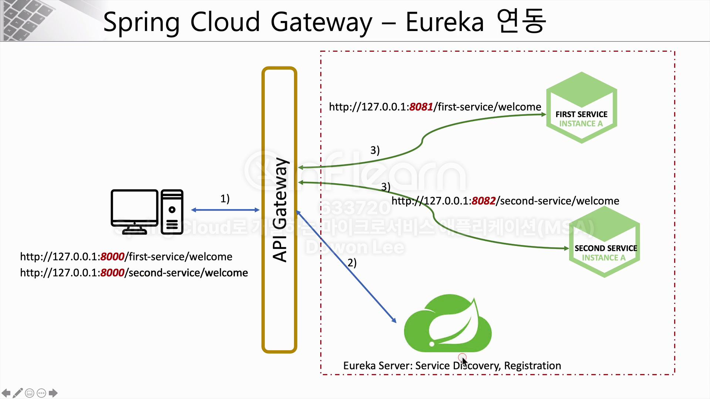
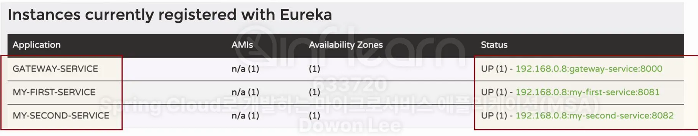
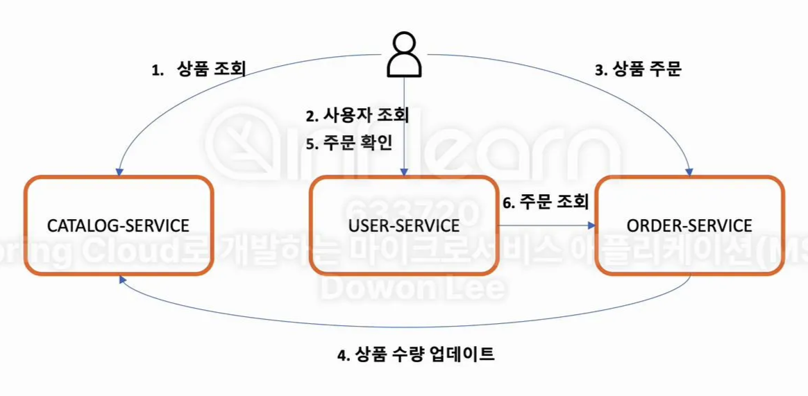
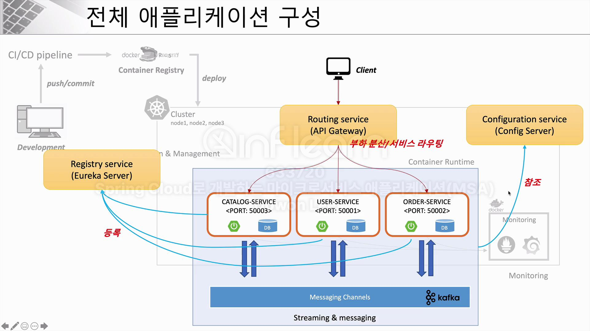
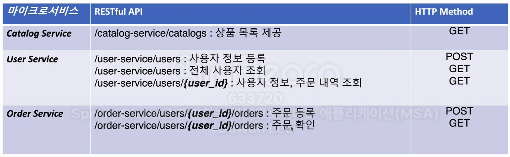

# week8

# 8주차 : Spring Cloud MSA #4

### 섹션3 : API Gateway Service

## Spring Cloud Gateway와 Eureka(Service Discovery) 연동

API Gateway로 클라이언트가 접근하면, Eureka Server에 등록되어있는 서비스로 포워딩 시키도록 구현한다.



GatewayService, First-Service, Second-Service 속 application.yml의 eureka client 속성을 변경한다

```yaml
eureka:
  client:
    register-with-eureka: true # true로 변경
    fetch-registry:  true # true로 변경
    service-url:
      defaultZone: http://localhost:8761/eureka
```

ApiGatewayService 프로젝트에서 first-service, second-service로의 엔드포인트를 수정한다

```yaml
spring:
  application:
    name: apigateway-service
  cloud:
    gateway:
      routes:
        - id: first-service
          uri: lb://MY-FIRST-SERVICE # lb://ServiceDiscovery 속 애플리케이션 이름
          predicates:
            - Path=/first-service/**
        - id: second-service
          uri: lb://MY-SECOND-SERVICE # lb://ServiceDiscovery 속 애플리케이션 이름
          predicates:
            - Path=/second-service/**
```

기존에는 `서버URL:포트` 방식으로 엔드포인트를 작성했다면, 이제는 ServiceDiscovery에 등록되어 있는 애플리케이션 이름(예: MY-FIRST-SERVICE)으로 엔드포인트를 수정한다.

Eureka Server(ServiceDiscovery)를 가장 먼저 실행시키고, GatewayService, First-Service, Second-Service 순서대로 실행시킨다. 그리고 ServiceDiscovery 콘솔에서 3개의 서비스가 등록되었음을 확인한다.



---
<br/>

## LoadBalancer 활용

이번에는 first-service를 두 개 기동시켜 LoadBalancer로 작업 분배가 이루어지는지 확인해본다.

3장에서 사용했던 방식과 비슷하게 서버의 포트를 랜덤 포트(0번)으로 설정하고, 인스턴스 id를 설정한다.

```yaml
server:
  port: 0
  
eureka:
  instance:
	  instance-id: ${spring.application.name}:${spring.application.instance_id:${random.value}}
```

로드밸런서로 요청이 분산될 때 어떤 first-service 인스턴스로 포워딩 되었는지 확인하기 위해 컨트롤러 메소드가 서버 port를 리턴하도록 수정한다.

```java
@RestController
@RequestMapping("/first-service")
@Slf4j
public class FirstServiceController {
  Environment env; // 환경 변수 객체를 불러온다
  
  @Autowired
  public FirstServiceController(Environment env) { this.env = env; }

  @GetMapping("/check")
  public String check(HttpServletRequest request) {
      log.info("Server port={}", request.getServerPort());
  
      log.info("spring.cloud.client.hostname={}", env.getProperty("spring.cloud.client.hostname"));
      log.info("spring.cloud.client.ip-address={}", env.getProperty("spring.cloud.client.ip-address"));
  
      return String.format("Hi, there. This is a message from First Service on PORT %s"
              , env.getProperty("local.server.port"));
  }
```

`localhost:8080/first-service/check` 로 접속해서 새로고침을 해보면 두 개의 포트가 번갈아 출력되는데, 이를 통해 라운드-로빈 방식으로 로드밸런싱이 되고있음을 알 수 있다.

### Spring Cloud Gateway 정리

이렇게 Gateway를 사용하게 되면 간단한 라우팅 기능과 더불어 로드밸런싱 기능까지 사용할 수 있다.

ServiceDiscovery와 Gateway를 같이 사용함으로써 ServiceDiscovery에 등록되어 있는 애플리케이션의 이름으로 아주 간단하게 포워딩을 수행할 수 있다. (직접 IP주소와 포트 번호를 지정할 필요가 없다는 것이 큰 장점)

---
<br/>

## 섹션4 : E-commerce 애플리케이션



E-commerce라는 애플리케이션의 구조이다. 각각의 마이크로 서비스는 역할을 명확히 구분지어야 한다.

4번 상품 수량 업데이트 과정에서는 Kafka를 이용해 MessageQueue 기능을 사용한다.



### 애플리케이션 구성 요소

| 구성 요소 | 설명 |
| --- | --- |
| Git Repository | 마이크로 서비스 소스 관리 및 프로파일 관리 |
| Config Server | Git 저장소에 등록된 프로파일 정보 및 설정 정보 |
| Eureka Server | 마이크로서비스 등록 및 검색 |
| API Gateway Server | 마이크로서비스 부하 분산 및 서비스 라우팅 |
| Microservices | 회원 MS, 주문 MS, 상품(카테고리) MS |
| Queuing System | 마이크로서비스 간 메시지 발행 및 구독 |

### 주요 API


