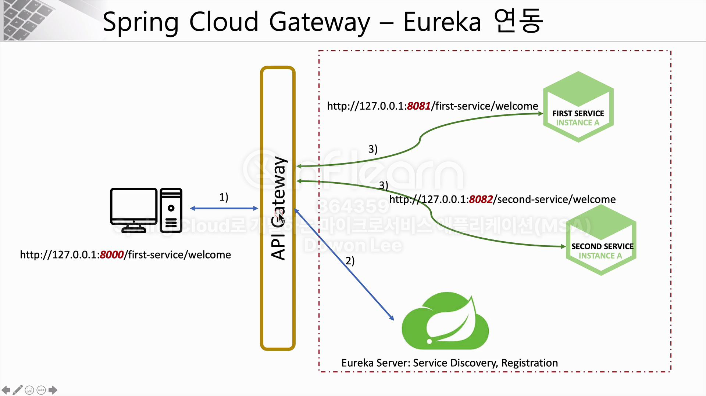
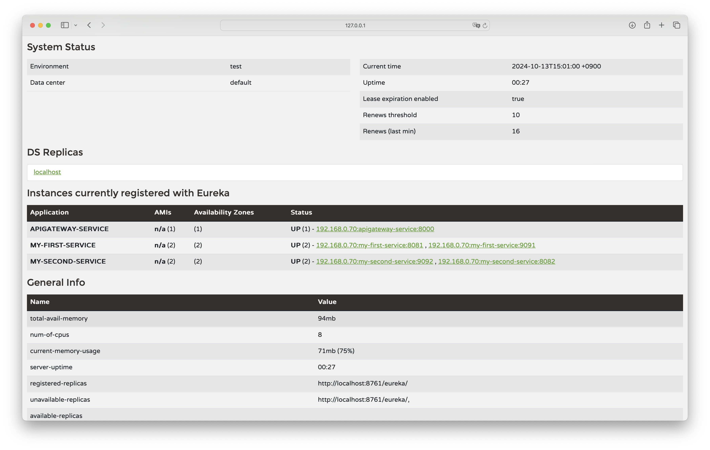

# 8주차

### Spring Cloud Gateway Eureka연동
- Eureka서비스를 기동시켜야 한다.
- 이 서비스의 역할은 서비스 디스커버리와 레지스트레이션, 서비스들의 등록을 담당해준다.

- 클라이언트가 api gateway8000번 포트로 요청을 보내면 eureak에 전달되고 eireka로부터 어디에 마이크로 서비스가 위치했는지 정보를 보내준다.
- 전달받은 정보로 직접 포워딩을 시켜준다.

 
- eureka와 연동을 위해 설정을 진행해야 한다.
``` yml
# apigateway service.yml
eureka:
  client:
    register-with-eureka: true
    fetch-registry: true
    service-url:
      defaultZone: http://localhost:8761/eureka
중략 ...
spring:
  application:
    name: apigateway-service
  cloud:
    gateway:
      routes:
        - id: first-service
          uri: lb://MY-FIRST-SERVICE #http://localhost:8081
        - id: second-service
          uri: lb://MY-SECOND-SERVICE #http://localhost:8082


# first-service.yml
eureka:
  client:
    register-with-eureka: true
    fetch-registry: true
    service-url:
      defaultZone: http://localhost:8761/eureka

# second-service
eureka:
  client:
    register-with-eureka: true
    fetch-registry: true
    service-url:
      defaultZone: http://localhost:8761/eureka
```
- 이렇게 apigateway service, first/second-service에서 eureka와 관련된 설정들을 지정하고 apigateway service에서 서비스1/2에 uri를 수정하면 eureka와 연동을 할 수 있다.

### Spring Cloud Gateway Road Balancer
- first/second service의 포트를 하나 더 추가하여 서비스를 기동해보자.
- 포트는 추가되었지만 유레카의 로드벨런서 기능을 통해 해당 포트로 직접 요청을 보내지 않고, 유레카에 의해 요청이 전달된다.
- 따라서 서비스1 : 8081, 서비스1 :9091 이라는 포트로 서비스가 실행중일때 클라이언트가 서비스1로 요청을 보내면 유레카가 서비스 1에 해당하는 서비스의 위치를 전달해주는 것이다.


# 섹션 4 이커머스 애플리케이션 구성.
- 레지스트리 서비스(유레카 서버)를 만든다.
- 카탈로그, 유저, 오더 서비스가 유레카 서버에 등록된다.
- 각각의 서비스가 서로 데이터를 주고받기 위한 용도로 메세징 큐잉 서버 카프카를 이용해 연동한다.
- 외부에서의 클라이언트 요청이 들어왔을 때 Spring Cloud Api Gateway를 이용해 부하 분산고 서비스 라우팅을 연동.
- Configuration Server(Config Server)를 이용해 서비스가 가지고 있어야 할 환경설정 정보를 마이크로 서비스 안에서 구현하는 것이 아니라 외부 서비스에 등록후 참조하여 사용하는 관계로 만든다.
- 쿠버네티스를 이용해 클러스터링 구조를 만든다. 