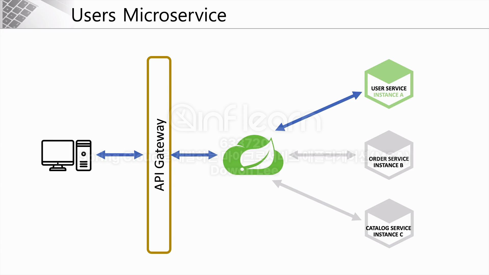
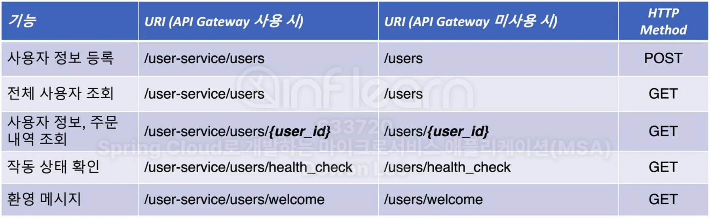
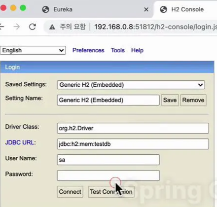

# 9주차 : Spring Cloud MSA

### 섹션5 : User Microservice



User Microservice는 E-commerce 서비스를 구성하는 여러 마이크로 서비스 중 하나이다. 클라이언트는 API Gateway를 거쳐서 Eureka Server에 등록되어 있는 User Microservice에 접근하게 된다.

### User Microservice의 기능들

- 신규 회원 등록
- 회원 로그인
- 상세 정보 확인
- 회원 정보 수정/삭제
- 상품 주문
- 주문 내역 확인

### User Microservice의 API 엔드포인트



### 프로젝트 생성

- 프로젝트 생성에 필요한 의존성을 추가한다
    - Spring Boot DevTools
    - Lombok
    - Spring Web
    - Eureka Discovery Client

- 상태 체크를 위한 컨트롤러를 생성한다
    
    ```java
    @RestController
    @RequestMapping("/")
    public class UserController {
        @GetMapping("/health_check")
        public String status() {
            return "It's working in User Service";
        }
    }
    ```
    

- Contig 정보 추가
    
    application.yml 파일에 message를 추가시킨다
    
    ```yaml
    greeting:
      message: Welcome to the Simple E-commerce.
    ```
    

- 컨트롤러 클래스에서 message를 불러온다
    
    불러오는 방법
    
    1. Environment (객체)
        
        ```java
        @RestController
        @RequestMapping("/")
        public class UserController {
            private Environment env;
        
            @Autowired
            public UserController(Environment env) {
                this.env = env;
            }
        
            @GetMapping("/health_check")
            public String status() {
                return "It's working in User Service";
            }
        
            @GetMapping("/welcome")
            public String welcome() {
        				return env.getProperty("greeting.message");
        				// Welcome to the Simple E-commerce.
            }
        
        }
        ```
        
    2. @Value (어노테이션)
        
        ```java
        // Greeting.java
        @Component
        @Data
        public class Greeting {
            @Value("${greeting.message}") // .yml에서 직접 가져옴
            private String message;
        }
        ```
        
        ```java
        @RestController
        @RequestMapping("/")
        public class UserController {
            @Autowired
            private Greeting greeting;
        
            @GetMapping("/health_check")
            public String status() {
                return "It's working in User Service";
            }
        
            @GetMapping("/welcome")
            public String welcome() {
                return greeting.getMessage();
            }
        
        }
        ```
        

- H2 DB 연동
    1. 의존성 추가 (pom.xml)
        
        ```xml
        <dependency>
            <groupId>com.h2database</groupId>
            <artifactId>h2</artifactId>
            <version>1.3.176</version> <!-- DB 자동 생성 지원을 위해 구버전 사용 -->
            <scope>runtime</scope>
        </dependency>
        ```
        
    2. H2 연결 설정 추가 (.yml)
        
        ```yaml
        spring:
          h2:
            console:
              enabled: true
              settings:
                web-allow-others: true
              path: /h2-console
        ```
        
    3. `localhost:{서버 포트}/h2-console` 로 접속하여 콘솔 로그인 창 확인
        
        