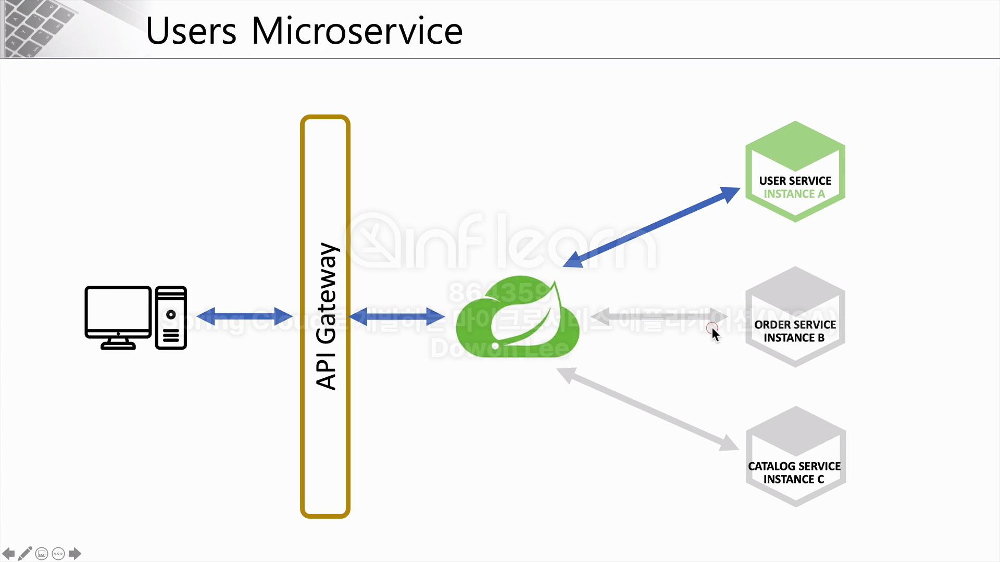
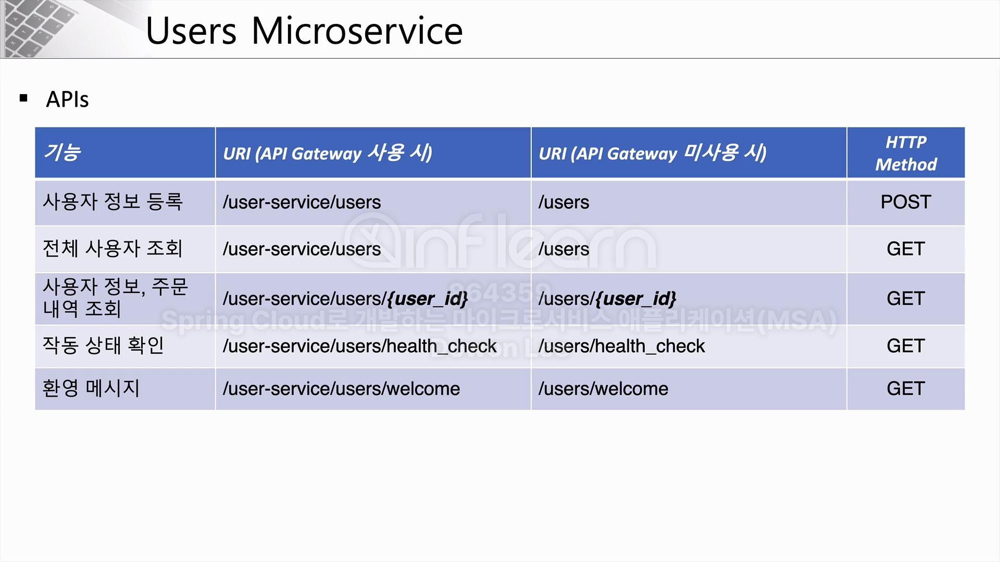

# 9주차

# Users MicroService 개요.
- 이전까지 학습한 스프링 클라우드, Netflex Eureka를 활용하여, 실제 서비스를 구현.
- 클라이언트의 요청을 받아줄 API Gateway와 API Gateway와 연결될 Spring Cloud. Spring Cloud(Eureka)와 연결된 각각의 마이크로 서비스로 구성.
- 마이크로 서비스에는 User Service, Order Service, Catalog Service로 구성.


- User Service에는 비즈니스 로직과 데이터베이스로 구성. UI단 없이 Rest통신으로 데이터 전달.


# 프로젝트 생성
``` java
@SpringBootApplication
@EnableDiscoveryClient
public class UserServiceApplication {

    public static void main(String[] args) {
        SpringApplication.run(UserServiceApplication.class, args);
    }

}
```
- @EnableDiscoveryClient 어노테이션을 추가해 유레카 서버에 등록.

# Welcome Method 생성
``` application.yml
# User-service application.yml
greeting:
  message: Welcome to the Simple E-commerce
```

``` java
// UserController.java
@RestController
@RequestMapping("/")
public class UserController {

    private Environment env;

    @Autowired
    private Greeting greeting;

    @Autowired
    public UserController(Environment env) {
        this.env = env;
    }

    @GetMapping("/helth_check")
    public String status() {
        return "It`s Working in User Service";
    }

    @GetMapping("/welcome")
    public String welcome() {
        return greeting.getMessage();
    }
}

// Greeting.java
@Component
@Data
public class Greeting {

    @Value("${greeting.message}")
    private String message;
}
```

- 클라이언트가 UserService에 Welcome에 요청을 보내면 yml에 greeting에 선언해 놓은 메시지를 응답한다.
- 메시지를 응답 하는 방법은 Environment객체를 생성하여 직접 접근하는 방법과, 별도의 클래스를 생성하여 @Value("${greeting.message}")어노테이션을 통해 값을 대입 후 필요한 클래스에서 get()메서드를 활용하여 값을 얻을 수 있다.

# H2 DataBase 연동
- H2 데이터베이스 사용을 위해 의존성 주입이 필요.
    - // https://mvnrepository.com/artifact/com.h2database/h2
    - testImplementation group: 'com.h2database', name: 'h2', version: '2.2.224'
- 그 후 yml파일에서 설정을 진행한다.
``` application.yml
spring:
  application:
    name: user-service
  h2:
    console:
      enabled: true
      settings:
        web-allow-others: true
      path: /h2-console
```