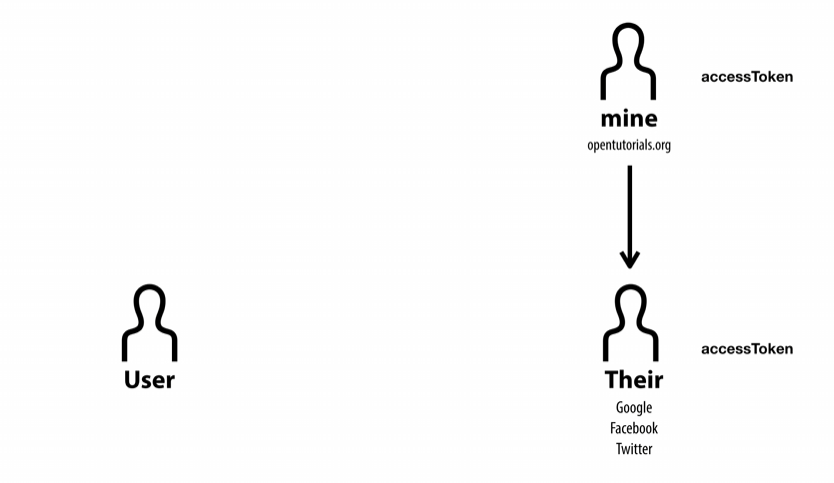

# Oauth 2.0 강의 정리

이 기술과 관련해서 세개의 참여자가 있다.

1. 나의 서비스
2. 이 서비스를 사용하는 사용자
3. 나의 서비스가 연동하려 하는 그들의 서비스(구글,페이스북,카카오)

나의 서비스로 구글 캘린더 작성이나 페이스북 작성같은걸 허락받아야한다

가장 쉬운건 사용자의 아이디 비번을 받아 이용하는것 → 아주 강력하지만 위험

이것이 유실되었을때 겪게될 고초는 대단할것

그래서 Oauth를 사용하면 서비스간 소통이 가능

그들의 서비스가 엑세스 토큰을 발급

그러면 나의 서비스가 요청하는 기능만을 허락

결론: **Oauth를 통해 엑세스토큰을 요청한다**

---

앞서 세가지 주체를 설명하였다.

1. 나의 서비스(mine)
2. 이 서비스를 사용하는 사용자(User)
3. 나의 서비스가 연동하려 하는 그들의 서비스(구글,페이스북,카카오)(Their)

이것들을 각각client,Resource Owner,Resource Server라 부른다.

---

**Oauth를 등록하는 첫번째 절차는 등록이다.**

클라이언트가 리소스서버를 이용하려면 승인을 사전에 받아야한다. 이를 등록이라함

서비스 마다 다르지만 이 세가지는 공통적으로 받음. 클라이언트 시크릿은 공개되면 안됨.

Authorized redirect URLs 주소로 요청을 하게 된다.

---

**두번째 절차는 인증이다.**

등록을 하게 되면 리소스 서버와 클라이언트는 핵심정보를 공유하게 된다.

물론 페이지를 구현해놓고 Authorized redirect URLs 주소를 준비해야함.

리소스 서버의 특정 기능만이 필요할때 모든 기능에 인증받는게 아니라 최소한의 기능만 인증받아야함.

리소스 오너가 기능을 쓰려 접속하려 하면 클라이언트는 위와 같은 안내창을 보여줄것이다.

그럼 우리는 

이런 주소를 만들어 보여주면 된다.

그럼 저 주소로 리소스 오너가 리소스 서버로 접속하는격.

로그인이 안되면 로그인 화면을 보여주고 로그인을 성공했으면 그때서야 클라이언트 아이디 값을 확인하고 리다이렉트URL 주소를 확인함.

그리고 맞다면 쓰려는 기능인 scope를 사용하려는지 권한을 요청하는 창을 띄움 

허용을 하면 허용했다고 리소스서버에 저장을 함.

---

이제는 리소스 서버가 승인을 해야한다.

바로 엑세스 토큰을 발급하지는 않고 authorization code 를 발급한다. 이것을 리소스 오너한테 응답한다.

그럼 리소스 오너는 그 주소로 이동하게 되고 그것을 클라이언트가 갖게됨.

그럼 클라이언트는 시크릿과 authorization code 정보를 가지고 리소스 서버에게 전송. 

리소스 서버는 클라이언트에게 전송한 이 정보들을 비교해보고 일치하면 그 다음단계인 엑세스 토큰 발급을 하게 된다.

---

**결국 Oauth의 목적은 엑세스 토큰을 발급하는것**

리소스 서버는 인증을 받았으므로 authorization code를 지운다.

리소스 서버는 엑세스 토큰을 드디어 발급하고 클라이언트에게 전송하게 된다.

---

리소스 서버를 조종하는 일종의 조작장치를 **API**라고 함

구글 캘린더를 조종하고 싶으면 구글 캘린더 API라고 검색하면 된다.

API 뒤에 acess_token=(엑세스토큰) 하면 허락을 받을수 있음

또는 curl 방식을 통해 헤더에 정보를 담아서 사용할수도 있음.

---

엑세스 토큰은 수명이 있다.

그 수명이 끝나면 api가 데이터를 주지 않으므로 다시 발급받아야 하는데 이 과정이 복잡함.

그래서 이를 새롭게 받게 해주는걸 Refresh token 이라 함.

원래는 리프레쉬 토큰을 엑세스 토큰을 같이 발급해서 클라이언트에게 넘긴다.

그리고api가 요청하면 엑세스 토큰을 넘긴다.

하지만 엑세스 토큰의 수명이 끝나면 우리의 클라이언트는 리프레쉬 토큰을 다시 리소스 서버에게 넘겨서 엑세스 토큰을 발급받는다.

---

***oauth는 3자가 한자리에 모일수 없는 상황에서 어떻게 서로를 신뢰할수 있을까에서 시작한 기술이다.***
